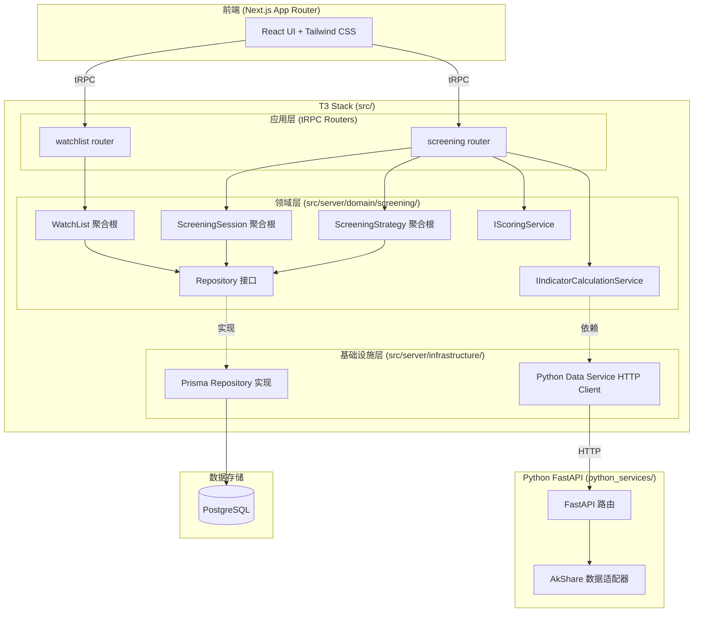
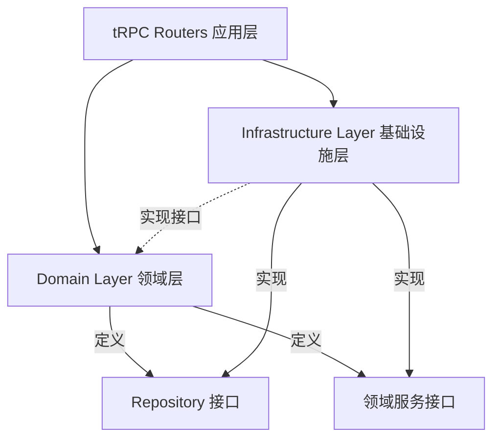

# 设计文档：股票筛选平台（Stock Screening Platform）

## 概述

本设计文档描述股票筛选平台 MVP 的技术架构和实现方案。系统采用 T3 Stack（Next.js 15 App Router + TypeScript + tRPC + Prisma + Tailwind CSS）作为主体，结合 Python FastAPI 微服务（AkShare 数据源），遵循 DDD 分层架构。

核心设计原则：
- **领域驱动设计**：Stock Screening Context 作为独立限界上下文，包含 3 个聚合根（ScreeningStrategy、ScreeningSession、WatchList）
- **依赖倒置**：领域层定义接口（IMarketDataRepository、IHistoricalDataProvider、IScoringService、IIndicatorCalculationService），基础设施层提供实现
- **T3 + Python 混合架构**：T3 侧负责 UI、业务逻辑编排、数据持久化；Python FastAPI 专门提供金融数据接口
- **tRPC 充当应用层入口**：编排领域服务调用，本身不含业务逻辑

## 架构

### 整体架构图



### 目录结构

```
src/
├── server/
│   ├── domain/
│   │   └── screening/                    # Stock Screening 限界上下文
│   │       ├── aggregates/               # 聚合根
│   │       │   ├── screening-strategy.ts
│   │       │   ├── screening-session.ts
│   │       │   └── watch-list.ts
│   │       ├── entities/                 # 实体
│   │       │   ├── filter-group.ts
│   │       │   └── stock.ts
│   │       ├── value-objects/            # 值对象
│   │       │   ├── filter-condition.ts
│   │       │   ├── indicator-value.ts
│   │       │   ├── scoring-config.ts
│   │       │   ├── screening-result.ts
│   │       │   ├── scored-stock.ts
│   │       │   ├── watched-stock.ts
│   │       │   └── stock-code.ts
│   │       ├── enums/                    # 枚举
│   │       │   ├── indicator-field.ts
│   │       │   ├── comparison-operator.ts
│   │       │   ├── logical-operator.ts
│   │       │   └── indicator-category.ts
│   │       ├── services/                 # 领域服务接口 + 实现
│   │       │   ├── scoring-service.ts
│   │       │   └── indicator-calculation-service.ts
│   │       ├── repositories/             # Repository 接口
│   │       │   ├── screening-strategy-repository.ts
│   │       │   ├── screening-session-repository.ts
│   │       │   ├── watch-list-repository.ts
│   │       │   ├── market-data-repository.ts
│   │       │   └── historical-data-provider.ts
│   │       └── errors.ts                 # 领域异常
│   │
│   ├── infrastructure/
│   │   └── screening/
│   │       ├── prisma-screening-strategy-repository.ts
│   │       ├── prisma-screening-session-repository.ts
│   │       ├── prisma-watch-list-repository.ts
│   │       └── python-data-service-client.ts   # HTTP client → FastAPI
│   │
│   └── api/
│       └── routers/
│           ├── screening.ts              # 筛选策略 + 执行 tRPC router
│           └── watchlist.ts              # 自选股 tRPC router
│
python_services/
├── app/
│   ├── main.py                           # FastAPI 入口
│   ├── routers/
│   │   └── stock_data.py                 # 股票数据路由
│   └── services/
│       └── akshare_adapter.py            # AkShare 数据适配器
├── requirements.txt
└── Dockerfile
```

### 分层依赖关系



关键约束：
- 领域层（`src/server/domain/`）不依赖任何外部库（Prisma、HTTP 等）
- 基础设施层实现领域层定义的接口
- tRPC Router 编排领域服务，不包含业务逻辑

## 组件与接口

### 1. 领域层核心组件

#### 1.1 聚合根：ScreeningStrategy

```typescript
// src/server/domain/screening/aggregates/screening-strategy.ts

interface ScreeningStrategyProps {
  id: string;
  name: string;
  description?: string;
  filters: FilterGroup;
  scoringConfig: ScoringConfig;
  tags: string[];
  isTemplate: boolean;
  userId: string;
  createdAt: Date;
  updatedAt: Date;
}

class ScreeningStrategy {
  // 核心行为
  execute(
    candidateStocks: Stock[],
    scoringService: IScoringService,
    calcService: IIndicatorCalculationService
  ): ScreeningResult;

  addFilter(condition: FilterCondition): void;
  removeFilter(condition: FilterCondition): void;
  updateScoringConfig(config: ScoringConfig): void;
  markAsTemplate(): void;
  cloneWithModifications(newName: string): ScreeningStrategy;

  // 不变量验证
  private validateInvariants(): void;
  // - name 非空
  // - filters 至少包含一个有效条件
  // - scoringConfig 权重之和 === 1.0
}
```

#### 1.2 聚合根：ScreeningSession

```typescript
// src/server/domain/screening/aggregates/screening-session.ts

interface ScreeningSessionProps {
  id: string;
  strategyId: string;
  strategyName: string;
  executedAt: Date;
  totalScanned: number;
  executionTime: number;
  topStocks: ScoredStock[];        // 前 50 只完整信息
  otherStockCodes: StockCode[];    // 其余只保存代码
  filtersSnapshot: FilterGroup;
  scoringConfigSnapshot: ScoringConfig;
}

class ScreeningSession {
  getAllMatchedCodes(): StockCode[];
  getStockDetail(code: StockCode): ScoredStock | null;
  getTopN(n: number): ScoredStock[];
  countMatched(): number;
}
```

#### 1.3 聚合根：WatchList

```typescript
// src/server/domain/screening/aggregates/watch-list.ts

class WatchList {
  addStock(code: StockCode, name: string, note?: string, tags?: string[]): void;
  removeStock(code: StockCode): void;
  updateStockNote(code: StockCode, note: string): void;
  updateStockTags(code: StockCode, tags: string[]): void;
  contains(code: StockCode): boolean;
  getStocksByTag(tag: string): WatchedStock[];
}
```

#### 1.4 实体：FilterGroup（递归结构）

```typescript
// src/server/domain/screening/entities/filter-group.ts

class FilterGroup {
  readonly groupId: string;
  readonly operator: LogicalOperator;
  readonly conditions: FilterCondition[];
  readonly subGroups: FilterGroup[];

  match(stock: Stock, calcService: IIndicatorCalculationService): boolean;
  hasAnyCondition(): boolean;
  countTotalConditions(): number;
  toDict(): Record<string, unknown>;
  static fromDict(data: Record<string, unknown>): FilterGroup;
}
```

#### 1.5 值对象：FilterCondition

```typescript
// src/server/domain/screening/value-objects/filter-condition.ts

class FilterCondition {
  readonly field: IndicatorField;
  readonly operator: ComparisonOperator;
  readonly value: IndicatorValue;

  evaluate(stock: Stock, calcService: IIndicatorCalculationService): boolean;
  validate(): ValidationResult;
  toDict(): Record<string, unknown>;
  static fromDict(data: Record<string, unknown>): FilterCondition;
}
```

#### 1.6 值对象：IndicatorValue（Tagged Union）

```typescript
// src/server/domain/screening/value-objects/indicator-value.ts

type IndicatorValue =
  | { type: "numeric"; value: number; unit?: string }
  | { type: "text"; value: string }
  | { type: "list"; values: string[] }
  | { type: "range"; min: number; max: number }
  | { type: "timeSeries"; years: number; threshold?: number };
```

#### 1.7 值对象：ScoringConfig

```typescript
// src/server/domain/screening/value-objects/scoring-config.ts

class ScoringConfig {
  readonly weights: Map<IndicatorField, number>;
  readonly normalizationMethod: NormalizationMethod;

  validate(): ValidationResult;
  // 不变量：权重之和 === 1.0
}
```

### 2. 领域服务接口

#### 2.1 IScoringService

```typescript
// src/server/domain/screening/services/scoring-service.ts

interface IScoringService {
  scoreStocks(
    stocks: Stock[],
    config: ScoringConfig,
    calcService: IIndicatorCalculationService
  ): ScoredStock[];
}
```

实现逻辑：
1. 对每只股票计算 config 中指定的指标值
2. 对每个指标在所有股票中做 MIN_MAX 归一化
3. 加权求和：`score = Σ(归一化值 × 权重)`
4. 缺失指标得分为 0

#### 2.2 IIndicatorCalculationService

```typescript
interface IIndicatorCalculationService {
  calculateIndicator(indicator: IndicatorField, stock: Stock): number | string | null;
  calculateBatch(indicators: IndicatorField[], stock: Stock): Map<IndicatorField, unknown>;
  validateDerivedIndicator(indicator: IndicatorField): ValidationResult;
}
```

实现路由：
- BASIC → `stock.getValue(indicator)`
- TIME_SERIES → 从 IHistoricalDataProvider 获取历史数据计算
- DERIVED → 硬编码公式（PE/PB、PEG、ROE-负债率等）

### 3. Repository 接口

```typescript
// 领域层定义接口，基础设施层实现

interface IScreeningStrategyRepository {
  save(strategy: ScreeningStrategy): Promise<void>;
  findById(id: string): Promise<ScreeningStrategy | null>;
  delete(id: string): Promise<void>;
  findAll(limit?: number, offset?: number): Promise<ScreeningStrategy[]>;
  findTemplates(): Promise<ScreeningStrategy[]>;
  findByName(name: string): Promise<ScreeningStrategy | null>;
}

interface IScreeningSessionRepository {
  save(session: ScreeningSession): Promise<void>;
  findById(id: string): Promise<ScreeningSession | null>;
  delete(id: string): Promise<void>;
  findByStrategy(strategyId: string, limit?: number): Promise<ScreeningSession[]>;
  findRecentSessions(limit?: number): Promise<ScreeningSession[]>;
}

interface IWatchListRepository {
  save(watchList: WatchList): Promise<void>;
  findById(id: string): Promise<WatchList | null>;
  delete(id: string): Promise<void>;
  findAll(): Promise<WatchList[]>;
  findByName(name: string): Promise<WatchList | null>;
}

interface IMarketDataRepository {
  getAllStockCodes(): Promise<StockCode[]>;
  getStock(code: StockCode): Promise<Stock | null>;
  getStocksByCodes(codes: StockCode[]): Promise<Stock[]>;
  getAvailableIndustries(): Promise<string[]>;
}

interface IHistoricalDataProvider {
  getIndicatorHistory(
    stockCode: StockCode,
    indicator: IndicatorField,
    years: number
  ): Promise<IndicatorDataPoint[]>;
}
```

### 4. tRPC Router（应用层）

```typescript
// src/server/api/routers/screening.ts

export const screeningRouter = createTRPCRouter({
  // 策略 CRUD
  createStrategy: protectedProcedure.input(createStrategySchema).mutation(...),
  updateStrategy: protectedProcedure.input(updateStrategySchema).mutation(...),
  deleteStrategy: protectedProcedure.input(z.object({ id: z.string() })).mutation(...),
  getStrategy: protectedProcedure.input(z.object({ id: z.string() })).query(...),
  listStrategies: protectedProcedure.input(listStrategiesSchema).query(...),

  // 执行筛选
  executeStrategy: protectedProcedure.input(z.object({ strategyId: z.string() })).mutation(...),

  // 历史查询
  listRecentSessions: protectedProcedure.input(paginationSchema).query(...),
  getSessionsByStrategy: protectedProcedure.input(z.object({ strategyId: z.string() })).query(...),
  getSessionDetail: protectedProcedure.input(z.object({ sessionId: z.string() })).query(...),
  deleteSession: protectedProcedure.input(z.object({ id: z.string() })).mutation(...),
});

// src/server/api/routers/watchlist.ts

export const watchlistRouter = createTRPCRouter({
  create: protectedProcedure.input(createWatchListSchema).mutation(...),
  delete: protectedProcedure.input(z.object({ id: z.string() })).mutation(...),
  list: protectedProcedure.query(...),
  addStock: protectedProcedure.input(addStockSchema).mutation(...),
  removeStock: protectedProcedure.input(removeStockSchema).mutation(...),
});
```

### 5. Python FastAPI 数据服务

```python
# python_services/app/routers/stock_data.py

@router.get("/stocks/codes")
async def get_all_stock_codes() -> list[str]: ...

@router.post("/stocks/batch")
async def get_stocks_by_codes(codes: list[str]) -> list[StockData]: ...

@router.get("/stocks/{code}/history")
async def get_indicator_history(
    code: str, indicator: str, years: int
) -> list[IndicatorDataPoint]: ...

@router.get("/stocks/industries")
async def get_available_industries() -> list[str]: ...
```

## 数据模型

### Prisma Schema 扩展

```prisma
// prisma/schema.prisma（新增模型）

model ScreeningStrategy {
    id            String   @id @default(cuid())
    name          String
    description   String?
    filters       Json     // FilterGroup 序列化
    scoringConfig Json     // ScoringConfig 序列化
    tags          String[] // PostgreSQL 数组
    isTemplate    Boolean  @default(false)
    createdAt     DateTime @default(now())
    updatedAt     DateTime @updatedAt

    userId        String
    user          User     @relation(fields: [userId], references: [id], onDelete: Cascade)
    sessions      ScreeningSession[]

    @@index([userId])
    @@index([isTemplate])
    @@index([name])
}

model ScreeningSession {
    id                    String   @id @default(cuid())
    strategyId            String?
    strategyName          String
    executedAt            DateTime @default(now())
    totalScanned          Int
    executionTime         Float
    topStocks             Json     // ScoredStock[] 序列化
    otherStockCodes       String[] // StockCode 数组
    filtersSnapshot       Json     // FilterGroup 快照
    scoringConfigSnapshot Json     // ScoringConfig 快照

    strategy              ScreeningStrategy? @relation(fields: [strategyId], references: [id], onDelete: SetNull)
    userId                String
    user                  User     @relation(fields: [userId], references: [id], onDelete: Cascade)

    @@index([userId])
    @@index([strategyId])
    @@index([executedAt])
}

model WatchList {
    id          String   @id @default(cuid())
    name        String
    description String?
    stocks      Json     @default("[]") // WatchedStock[] 序列化
    createdAt   DateTime @default(now())
    updatedAt   DateTime @updatedAt

    userId      String
    user        User     @relation(fields: [userId], references: [id], onDelete: Cascade)

    @@index([userId])
    @@index([name])
}
```

### JSON 字段序列化格式

FilterGroup JSON 结构：
```json
{
  "groupId": "uuid",
  "operator": "AND",
  "conditions": [
    {
      "field": "ROE",
      "operator": "GREATER_THAN",
      "value": { "type": "numeric", "value": 0.15 }
    }
  ],
  "subGroups": [
    {
      "groupId": "uuid",
      "operator": "OR",
      "conditions": [...],
      "subGroups": []
    }
  ]
}
```

ScoringConfig JSON 结构：
```json
{
  "weights": { "ROE": 0.3, "PE": 0.2, "REVENUE_CAGR_3Y": 0.5 },
  "normalizationMethod": "MIN_MAX"
}
```

ScoredStock JSON 结构：
```json
{
  "stockCode": "600519",
  "stockName": "贵州茅台",
  "score": 0.85,
  "scoreBreakdown": { "ROE": 0.9, "PE": 0.7 },
  "indicatorValues": { "ROE": 0.28, "PE": 35.5 },
  "matchedConditions": [
    { "field": "ROE", "operator": "GREATER_THAN", "value": { "type": "numeric", "value": 0.15 } }
  ]
}
```

WatchedStock JSON 结构：
```json
{
  "stockCode": "600519",
  "stockName": "贵州茅台",
  "addedAt": "2024-01-01T00:00:00Z",
  "note": "长期看好",
  "tags": ["白酒", "高ROE"]
}
```

### Python 数据服务响应格式

StockData 响应：
```json
{
  "code": "600519",
  "name": "贵州茅台",
  "industry": "白酒",
  "sector": "主板",
  "roe": 0.28,
  "pe": 35.5,
  "pb": 10.2,
  "eps": 50.3,
  "revenue": 1275.5,
  "netProfit": 620.8,
  "debtRatio": 0.25,
  "marketCap": 21000.0,
  "floatMarketCap": 20500.0,
  "dataDate": "2024-01-15"
}
```

IndicatorDataPoint 响应：
```json
{
  "date": "2023-12-31",
  "value": 0.25,
  "isEstimated": false
}
```


## 正确性属性（Correctness Properties）

*正确性属性是系统在所有有效执行中都应保持为真的特征或行为——本质上是关于系统应该做什么的形式化陈述。属性是人类可读规范与机器可验证正确性保证之间的桥梁。*

以下属性基于需求文档中的验收标准推导而来，每个属性都包含显式的"对于所有"全称量化声明，用于指导属性基测试（Property-Based Testing）。

### Property 1: 策略业务不变量验证

*对于任意* ScreeningStrategy，在创建或更新后，以下不变量必须同时成立：(a) name 非空，(b) filters 包含至少一个有效条件（递归检查），(c) scoringConfig 的权重之和等于 1.0（浮点精度 ±0.001）。违反任一不变量的操作应被拒绝并抛出验证错误。

**Validates: Requirements 1.2, 1.5, 1.6**

### Property 2: 策略克隆深拷贝独立性

*对于任意* ScreeningStrategy，调用 cloneWithModifications 生成的新策略应与原策略具有相同的 FilterGroup 结构和 ScoringConfig 值，但修改新策略的 filters 或 scoringConfig 不应影响原策略的对应字段。

**Validates: Requirements 1.4**

### Property 3: FilterCondition 构造验证

*对于任意* IndicatorField、ComparisonOperator 和 IndicatorValue 的组合，FilterCondition 的构造应当且仅当满足以下条件时成功：(a) field 的 valueType 与 value 的类型匹配（NUMERIC 对应 numeric/range/timeSeries，TEXT 对应 text/list），(b) operator 与 value 类型兼容（GREATER_THAN 等仅适用于 numeric，IN/NOT_IN 仅适用于 list，BETWEEN 仅适用于 range）。

**Validates: Requirements 2.2, 2.3**

### Property 4: FilterGroup 与 FilterCondition 序列化往返一致性

*对于任意* 有效的 FilterGroup（包含任意深度的递归嵌套和各类 FilterCondition），执行 `FilterGroup.fromDict(filterGroup.toDict())` 应产生与原始 FilterGroup 结构等价的对象。

**Validates: Requirements 2.5, 2.6**

### Property 5: FilterGroup 递归匹配语义正确性

*对于任意* FilterGroup 树和任意 Stock，match 方法的结果应满足：(a) AND 组：所有子条件和子组都匹配时返回 true，(b) OR 组：至少一个子条件或子组匹配时返回 true，(c) NOT 组：对唯一子元素的匹配结果取反。

**Validates: Requirements 2.1**

### Property 6: 筛选结果按评分降序排列

*对于任意* ScreeningStrategy 和任意候选股票列表，执行 execute 后生成的 ScreeningResult 中 matchedStocks 列表应按 score 降序排列（即对于任意相邻元素 i 和 i+1，`matchedStocks[i].score >= matchedStocks[i+1].score`）。

**Validates: Requirements 3.1**

### Property 7: 缺失指标值导致条件不匹配

*对于任意* FilterCondition 和任意 Stock，当 Stock 对应 IndicatorField 的值为 null 时，evaluate 方法应返回 false。

**Validates: Requirements 3.3**

### Property 8: 评分归一化值域不变量

*对于任意* 非空股票列表和任意有效 ScoringConfig，IScoringService.scoreStocks 返回的每个 ScoredStock 的 score 应在 [0, 1] 区间内，且 scoreBreakdown 中每个指标的归一化得分也应在 [0, 1] 区间内。

**Validates: Requirements 3.4**

### Property 9: ScreeningSession 分层存储不变量

*对于任意* ScreeningResult 生成的 ScreeningSession，topStocks 的长度应不超过 50，且 `topStocks.length + otherStockCodes.length` 应等于筛选匹配的总股票数。

**Validates: Requirements 3.6**

### Property 10: WatchList 添加/移除/包含一致性

*对于任意* WatchList 和任意 StockCode：(a) 添加后 contains 返回 true，(b) 移除后 contains 返回 false，(c) 对已存在的 StockCode 再次添加应抛出 DuplicateStockError。

**Validates: Requirements 5.2, 5.3, 5.4**

### Property 11: WatchList 标签过滤正确性

*对于任意* WatchList 和任意标签字符串，getStocksByTag 返回的所有 WatchedStock 都应包含该标签，且 WatchList 中所有包含该标签的 WatchedStock 都应出现在返回结果中。

**Validates: Requirements 5.5**

### Property 12: HTTP 响应到领域对象映射正确性

*对于任意* 有效的 Python_Data_Service 股票数据 JSON 响应，基础设施层 HTTP Client 映射生成的 Stock 实体应包含与原始 JSON 中所有非 null 字段对应的正确值。

**Validates: Requirements 6.4**

## 错误处理

### 领域层异常

| 异常类型 | 触发场景 | 处理方式 |
|---|---|---|
| `InvalidStrategyError` | 策略不变量验证失败（名称为空、无条件、权重不为 1.0） | tRPC 返回 BAD_REQUEST |
| `DuplicateStockError` | 向 WatchList 添加已存在的股票 | tRPC 返回 CONFLICT |
| `StockNotFoundError` | 从 WatchList 移除不存在的股票 | tRPC 返回 NOT_FOUND |
| `InvalidFilterConditionError` | FilterCondition 类型不匹配或运算符不兼容 | tRPC 返回 BAD_REQUEST |
| `ScoringError` | 评分计算失败（如所有股票某指标均为 null） | tRPC 返回 INTERNAL_SERVER_ERROR |
| `IndicatorCalculationError` | 指标计算失败（除零、数据缺失） | 返回 null，由上层处理 |

### 基础设施层异常

| 异常类型 | 触发场景 | 处理方式 |
|---|---|---|
| `DataNotAvailableError` | Python 数据服务返回错误或超时 | tRPC 返回 SERVICE_UNAVAILABLE，包含错误详情 |
| `RepositoryError` | Prisma 数据库操作失败 | tRPC 返回 INTERNAL_SERVER_ERROR |

### tRPC 错误映射

```typescript
// 在 tRPC router 中统一处理领域异常
function mapDomainError(error: unknown): TRPCError {
  if (error instanceof InvalidStrategyError) {
    return new TRPCError({ code: "BAD_REQUEST", message: error.message });
  }
  if (error instanceof DuplicateStockError) {
    return new TRPCError({ code: "CONFLICT", message: error.message });
  }
  if (error instanceof DataNotAvailableError) {
    return new TRPCError({ code: "INTERNAL_SERVER_ERROR", message: error.message });
  }
  return new TRPCError({ code: "INTERNAL_SERVER_ERROR", message: "未知错误" });
}
```

## 测试策略

### 测试框架选择

| 层级 | 测试框架 | 用途 |
|---|---|---|
| TypeScript 单元测试 | Vitest | 领域层、值对象、实体测试 |
| TypeScript 属性基测试 | fast-check + Vitest | 正确性属性验证 |
| Python 单元测试 | pytest | FastAPI 路由、AkShare 适配器测试 |
| 集成测试 | Vitest + Prisma (test DB) | Repository 实现、tRPC Router 测试 |

### 双轨测试方法

**单元测试**：验证具体示例、边界情况和错误条件
- 具体的 FilterCondition 评估示例（ROE > 0.15 对特定股票）
- 边界情况：空 FilterGroup、权重精度边界、NOT 组多子元素
- 错误条件：无效类型组合、除零、null 处理

**属性基测试**：验证跨所有输入的通用属性
- 每个属性测试至少运行 100 次迭代
- 使用 fast-check 生成随机输入
- 每个测试标注对应的设计文档属性编号
- 标注格式：`Feature: stock-screening-platform, Property {N}: {属性标题}`

### 属性基测试生成器设计

```typescript
// 核心生成器
const arbStockCode = fc.stringOf(fc.constantFrom("0", "3", "6"), { minLength: 6, maxLength: 6 });
const arbIndicatorField = fc.constantFrom(...Object.values(IndicatorField));
const arbNumericValue = fc.record({ type: fc.constant("numeric"), value: fc.double({ min: -1000, max: 10000 }) });
const arbTextValue = fc.record({ type: fc.constant("text"), value: fc.string({ minLength: 1 }) });
const arbFilterCondition = fc.tuple(arbIndicatorField, arbComparisonOperator, arbIndicatorValue)
  .filter(([field, op, value]) => isCompatible(field, op, value))
  .map(([field, op, value]) => new FilterCondition(field, op, value));
const arbFilterGroup = fc.letrec(tie => ({
  group: fc.oneof(
    // 叶子节点：只有条件
    fc.record({ operator: arbLogicalOperator, conditions: fc.array(arbFilterCondition, { minLength: 1, maxLength: 3 }), subGroups: fc.constant([]) }),
    // 递归节点
    fc.record({ operator: arbLogicalOperator, conditions: fc.array(arbFilterCondition, { maxLength: 2 }), subGroups: fc.array(tie("group"), { minLength: 1, maxLength: 2 }) })
  )
})).group;
const arbScoringConfig = fc.array(fc.tuple(arbNumericIndicator, fc.double({ min: 0.01, max: 1 })), { minLength: 1, maxLength: 5 })
  .map(pairs => normalizeTo1(pairs))
  .map(weights => new ScoringConfig(weights, NormalizationMethod.MIN_MAX));
```

### 测试覆盖矩阵

| 正确性属性 | 单元测试 | 属性基测试 | 需求覆盖 |
|---|---|---|---|
| Property 1: 策略不变量 | ✅ 边界值 | ✅ 随机策略 | 1.2, 1.5, 1.6 |
| Property 2: 克隆独立性 | ✅ 具体示例 | ✅ 随机策略 | 1.4 |
| Property 3: 条件构造验证 | ✅ 类型组合 | ✅ 随机组合 | 2.2, 2.3 |
| Property 4: 序列化往返 | ✅ 具体结构 | ✅ 随机树 | 2.5, 2.6 |
| Property 5: 递归匹配 | ✅ 具体表达式 | ✅ 随机树+股票 | 2.1 |
| Property 6: 结果排序 | ✅ 具体列表 | ✅ 随机股票集 | 3.1 |
| Property 7: 缺失值不匹配 | ✅ 具体条件 | ✅ 随机条件+null | 3.3 |
| Property 8: 评分值域 | ✅ 边界值 | ✅ 随机股票集 | 3.4 |
| Property 9: 分层存储 | ✅ 边界(50) | ✅ 随机结果集 | 3.6 |
| Property 10: WatchList 一致性 | ✅ 具体操作 | ✅ 随机操作序列 | 5.2, 5.3, 5.4 |
| Property 11: 标签过滤 | ✅ 具体标签 | ✅ 随机标签集 | 5.5 |
| Property 12: HTTP 映射 | ✅ 具体响应 | ✅ 随机 JSON | 6.4 |
