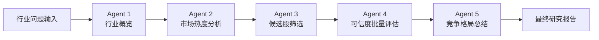
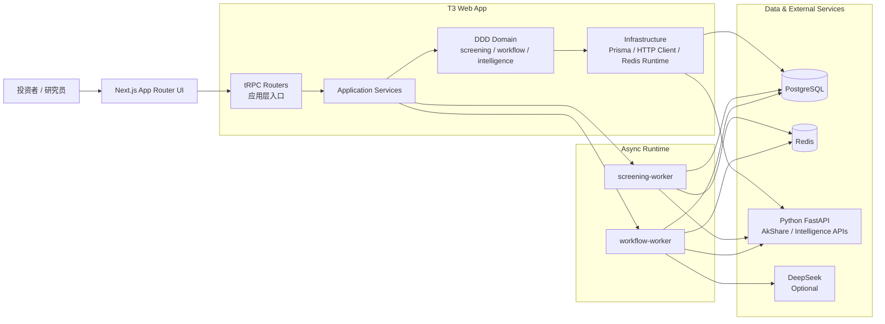

# AlphaFlow

面向股票投研场景的智能工作流平台。

AlphaFlow 将选股筛选、行业研究、公司研究与异步任务编排整合到一个可配置、可追踪的系统中，帮助研究者减少信息噪音，更快聚焦高价值标的，并沉淀可复用的投研流程。

<!-- readme-gen:start:badges -->
<div align="center">
  
  
  
  
  
  

</div>
<!-- readme-gen:end:badges -->

<!-- readme-gen:start:tech-stack -->
<div align="center">
  
</div>
<!-- readme-gen:end:tech-stack -->

<!-- readme-gen:start:overview -->
## 为什么是它

`AlphaFlow` 不是单纯的“股票列表页”，而是一套围绕 **投研工作流** 设计的工程化平台：

- **策略沉淀**：将筛选条件与评分规则建模为领域对象，可复用、可版本化、可重复执行。
- **研究提速**：通过 `quick_industry_research` 模板把行业概览、热度分析、候选股筛选与可信度评估串成一个五节点工作流。
- **异步可追踪**：`workflow-worker` 与 `screening-worker` 在后台轮询执行任务，运行状态、节点明细与事件流可回放。
- **数据职责清晰**：Web 端负责业务编排和持久化，Python FastAPI 微服务专职对接 AkShare 与情报数据接口。
- **DDD 分层明确**：`domain / application / infrastructure / api` 结构让业务规则、基础设施和入口编排各归其位。

### 当前已落地的核心能力

| 模块 | 已有能力 |
| --- | --- |
| 筛选策略工作台 | 创建 / 更新 / 删除策略，组合 `FilterGroup` 与 `ScoringConfig`，生成并回看 `ScreeningSession` |
| 自选股管理 | 分组管理、自定义备注、股票标签维护、按标签检索 |
| 行业快研工作流 | 启动快速研究、查看运行状态、取消任务、查看节点进度与最终报告 |
| 后台执行体系 | `workflow-worker` / `screening-worker` 消费任务，依赖 Redis 维护运行态 |
| Python 数据网关 | 提供股票基础数据、主题资讯、候选股、证据接口与概念映射能力 |
| 认证体系 | NextAuth + Prisma Adapter，支持本地账号密码，并预留微信 / QQ Provider |
<!-- readme-gen:end:overview -->

## 核心投研工作流

项目当前围绕四条彼此衔接的研究链路组织能力，目标是先缩小噪音，再逐层提高判断密度：

| 工作流 | 简要说明 |
| --- | --- |
| 股票海选 | 从自定义筛选策略出发，对全市场或候选范围做规则过滤、评分排序与证据补全，先把“能看什么”收敛成可回看的机会池。 |
| 行业研究 | 把研究问题、约束和偏好收进 LangGraph 工作流，依次完成范围澄清、研究规划、分单元执行、缺口分析与报告合成，用于快速判断一个方向值不值得继续深挖。 |
| 公司研究 | 围绕单一公司和关键问题展开，联动官网、财务、新闻与行业资料，整理证据、补齐引用并输出最终公司判断，帮助把行业机会落实到具体标的。 |
| 择时研究 | 接住股票海选或自选股结果，支持单股信号、批量信号、组合建议与择时复盘，并结合市场状态与风险预算给出更接近执行层的动作建议。 |

这四条工作流可以独立运行，也可以按“股票海选 → 行业研究 / 公司研究 → 择时研究”的顺序逐步收敛，从机会发现一路走到研究确认与组合动作。

<!-- readme-gen:start:quick-start -->
## 快速开始

### 方式 A：Docker Compose（推荐）

项目已提供完整的多服务编排，适合首次体验或联调：

```bash
cp deploy/.env.example deploy/.env
docker compose --env-file deploy/.env -f deploy/docker-compose.yml up -d --build
```

启动后默认服务：

- Web：`http://localhost:3000`
- Python API Docs：`http://localhost:8000/docs`
- PostgreSQL：`localhost:5432`

容器编排包含：`web`、`python-service`、`workflow-worker`、`screening-worker`、`redis`、`postgres`。

### 方式 B：本地开发

#### 1. 安装依赖

```bash
npm install

cd python_services
python -m venv .venv
# Windows
.venv\Scripts\activate
pip install -r requirements.txt
# Optional: Python tests
# pip install -r requirements-dev.txt
# Optional: RefChecker runtime
# pip install -r requirements-refchecker.txt
cd ..
```

#### 2. 配置环境变量

```bash
cp .env.example .env
```

至少确认这些变量可用：

| 变量 | 说明 |
| --- | --- |
| `AUTH_SECRET` | NextAuth 会话密钥 |
| `DATABASE_URL` | PostgreSQL 连接串 |
| `REDIS_URL` | 异步运行时与事件流存储 |
| `PYTHON_SERVICE_URL` | 筛选数据服务地址 |
| `PYTHON_INTELLIGENCE_SERVICE_URL` | 行业快研数据服务地址 |
| `DEEPSEEK_API_KEY` | 可选，用于研究总结增强 |

默认本地账号密码来自环境变量：`admin / admin123456`。正式使用前请务必修改。

#### 3. 初始化数据库

```bash
npm run db:push
```

#### 4. 启动服务

终端 A：启动 Python 微服务

```bash
cd python_services
uvicorn app.main:app --reload --host 0.0.0.0 --port 8000
```

终端 B：启动 Next.js

```bash
npm run dev
```

终端 C：启动筛选任务 Worker

```bash
npm run worker:screening
```

终端 D：启动工作流 Worker

```bash
npm run worker:workflow
```
<!-- readme-gen:end:quick-start -->

<!-- readme-gen:start:workflow -->
## 行业快研工作流

当前仓库已落地的标准模板是 `quick_industry_research`，由五个顺序节点组成：



输出结果包含：

- 行业概览与热度结论
- 候选标的与评分原因
- 候选股可信度亮点 / 风险
- Top Picks 与竞争格局总结
- 可回放的运行进度与节点事件
<!-- readme-gen:end:workflow -->

<!-- readme-gen:start:architecture -->
## 架构总览



### DDD 分层与边界上下文

- `src/server/domain/screening/`：筛选策略、筛选会话、自选股聚合与领域服务。
- `src/server/domain/workflow/`：工作流模板、运行状态、事件流与错误模型。
- `src/server/domain/intelligence/`：面向研究流程的情报领域类型。
- `src/server/api/routers/`：tRPC 作为应用入口，仅负责输入校验、编排与错误映射。
- `src/server/infrastructure/`：Prisma 仓储、Python HTTP Client、LangGraph 运行时、Redis 状态存储。

### 数据持久化模型

Prisma 当前已覆盖这些核心模型：

- `ScreeningStrategy`
- `ScreeningSession`
- `WatchList`
- `WorkflowTemplate`
- `WorkflowRun`
- `WorkflowNodeRun`
- `WorkflowEvent`
<!-- readme-gen:end:architecture -->

<!-- readme-gen:start:tree -->
## 项目结构

```text
AlphaFlow/
├─ src/
│  ├─ app/                          # Next.js App Router 页面与客户端组件
│  ├─ contracts/                    # 前后端共享输入输出约束
│  ├─ server/
│  │  ├─ api/routers/               # tRPC 入口
│  │  ├─ application/               # 应用服务编排
│  │  ├─ domain/                    # screening / workflow / intelligence
│  │  ├─ infrastructure/            # Prisma / HTTP client / LangGraph / Redis
│  │  └─ auth/                      # NextAuth 配置
│  └─ generated/                    # Prisma Client 输出目录
├─ prisma/
│  └─ schema.prisma                 # PostgreSQL 数据模型
├─ python_services/
│  ├─ app/                          # FastAPI 服务、AkShare 适配、情报接口
│  ├─ tests/                        # Python 侧测试
│  └─ requirements.txt
├─ tooling/
│  ├─ vitest.config.ts
│  └─ workers/                      # screening-worker / workflow-worker
├─ deploy/                          # Docker Compose 与镜像构建
├─ docs/                            # 方案、计划与上下文文档
└─ README.md
```
<!-- readme-gen:end:tree -->

<!-- readme-gen:start:scripts -->
## 常用命令

| 命令 | 说明 |
| --- | --- |
| `npm run dev` | 启动 Next.js 本地开发服务 |
| `npm run build` | 构建生产版本 |
| `npm run preview` | 构建后以生产模式启动 |
| `npm run db:push` | 将 Prisma Schema 同步到数据库 |
| `npm run db:studio` | 打开 Prisma Studio |
| `npm run worker:screening` | 启动筛选 Worker |
| `npm run worker:workflow` | 启动工作流 Worker |
| `npm run check` | 运行 Biome 检查 |
| `npm run check:write` | 自动修复可修复的问题 |
| `npm run typecheck` | 运行 TypeScript 严格类型检查 |
| `npm test` | 运行 Vitest 测试 |
| `npm run test:coverage` | 生成 TypeScript 测试覆盖率 |
| `cd python_services && pytest` | 运行 Python 微服务测试 |
<!-- readme-gen:end:scripts -->

<!-- readme-gen:start:health -->
## 工程健康度

> 以下为本地仓库扫描结果，用于帮助快速判断工程成熟度。

| 项目 | 状态 | 说明 |
| --- | --- | --- |
| 类型安全 | ✅ | `tsconfig.json` 开启 `strict` 与 `noUncheckedIndexedAccess` |
| 代码规范 | ✅ | 使用 `Biome` 管理格式化与 Lint |
| TypeScript 测试 | ✅ | 25 个测试文件，含 `fast-check` 属性测试 |
| Python 测试 | ✅ | 6 个 `pytest` 测试文件 |
| 异步运行时 | ✅ | Redis + `workflow-worker` + `screening-worker` |
| 微服务协作 | ✅ | Next.js 与 FastAPI 通过 HTTP API 解耦 |

## 延伸阅读

- [Docker Desktop 部署说明](./deploy/README.md)
- [Python 数据服务说明](./python_services/README.md)
- [产品与方案文档](./docs/)
<!-- readme-gen:end:health -->

<!-- readme-gen:start:footer -->
<div align="center">
  

  <p>
    Built for focused investing workflows, not market noise.
  </p>
</div>
<!-- readme-gen:end:footer -->

## Voice Intake

- `行业研究` 与 `公司判断` 页面支持浏览器录音输入，使用 `@ricky0123/vad-web` 自动停录，录音上限 90 秒。
- 语音只作为表单预填增强：不会落库，不会改 workflow graph，也不会自动启动研究流程。
- Python `python-service` 仅做 FunASR 转写；T3 侧负责文本整理、字段映射和置信度 guardrail。
- 低置信度结果只会写入主问题字段；其余字段不会自动覆盖。
- Docker 默认会把 FunASR 模型烘焙进 `python-service` 镜像；非 Docker 本地调试可执行：

```bash
python python_services/scripts/download_funasr_models.py --output-dir python_services/models/funasr
```
