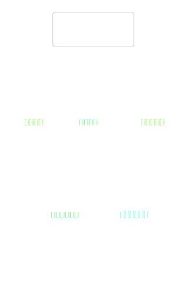

# 热点洞察：company-research-graph.ts

- 源文件: `src/server/infrastructure/workflow/langgraph/company-research-graph.ts`
- 热点分数: `77`
- 主入口: `mergeStringArrays`
- 触发原因: `峰值函数圈复杂度 >= 10 (WorkflowPauseError=21)；嵌套深度 >= 4 且判定点 >= 6 (WorkflowPauseError: nesting=4, decisions=20)；显式状态/生命周期复杂 (2 states, 55 transitions)`

这是一份以图为主的脚手架文档。请先补齐图中的真实角色、依赖和路径，再在每张图两侧补充贴图解释。

开头引导：先看下面这组架构图，建立这个热点文件所在位置、内部拆分和依赖职责的整体轮廓，再进入流程细节。

## 架构图组

这一组图默认优先生成，用来回答“它在系统哪里、内部怎么分、依赖如何协作”。

### 架构总览图

图前说明：先看这个文件位于哪一层、被谁触发、向哪些外部角色发起协作。

图后解读：补全真实调用方、外部系统和边界约束后，这张图应能回答“它在整体架构中的位置”。

### 模块拆解图

图前说明：这张图把文件内部的关键职责分成几个稳定模块，帮助快速识别边界。

图后解读：补齐真实模块名称后，这张图应能回答“内部职责如何拆分，哪些模块不要混改”。

### 依赖职责图

图前说明：重点看入口如何把职责分派给不同依赖，以及每个依赖承担什么角色。

图后解读：补齐真实依赖职责后，这张图应能回答“入口是如何协调多个依赖完成任务的”。

## 主流程活动图

### 主流程活动图

图前说明：沿着主入口顺序阅读，先建立正常路径的执行心智模型。

图后解读：把真实输入、关键判定和产出补进去后，这张图应能回答“正常流程到底怎么走”。

## 协作顺序图

### 协作顺序图

图前说明：这张图强调调用时序，适合定位谁先发起、谁后响应、哪里容易串线。

图后解读：把真实协作者和消息名补进去后，这张图应能回答“关键协作顺序是否符合预期”。

## 分支判定图

### 分支判定图

图前说明：把主要分支和守卫条件单独抽出来，便于区分正常路径与特殊路径。

图后解读：把真实条件替换进去后，这张图应能回答“哪些条件最容易引发路径分叉”。

## 状态图

### 状态图

图前说明：当文件存在状态切换时，优先看清每个阶段之间如何流转。

图后解读：把真实状态和值守条件补齐后，这张图应能回答“状态变更的触发器和退出点是什么”。

## 异步/并发图

### 异步/并发图

图前说明：这张图专门突出异步触发、并发协作和等待回收的关系。

图后解读：把真实队列、回调和等待点补进去后，这张图应能回答“并发协调风险集中在哪”。

## 数据/依赖流图

### 数据/依赖流图

图前说明：按数据从输入到输出的流向阅读，能更快看清中间变换链路。

图后解读：把真实数据对象补齐后，这张图应能回答“数据在各协作者之间怎样被加工和交付”。

结尾总结：补齐真实角色名称、关键条件和产出物后，这一页应能让人先通过图建立心智模型，再回到源码核对细节。
