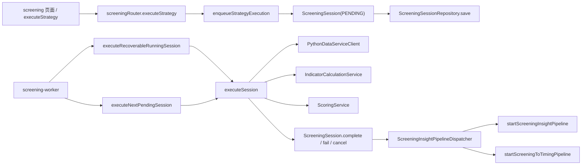
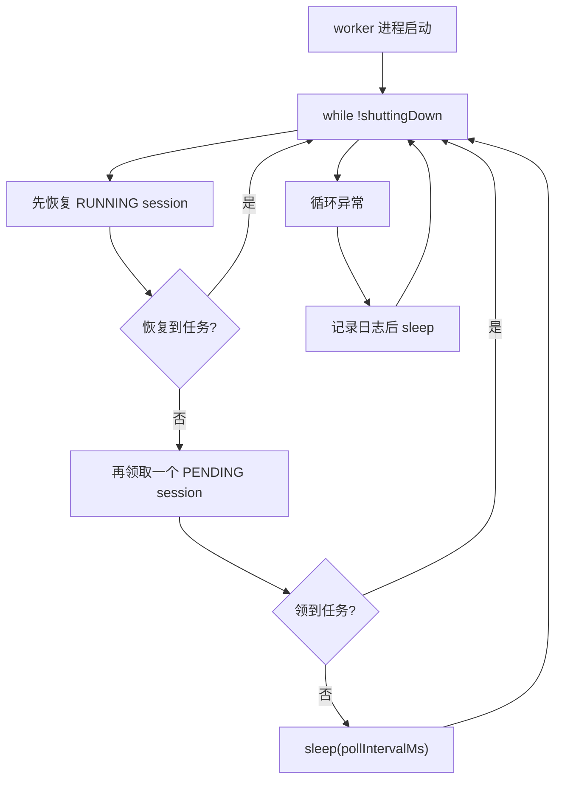
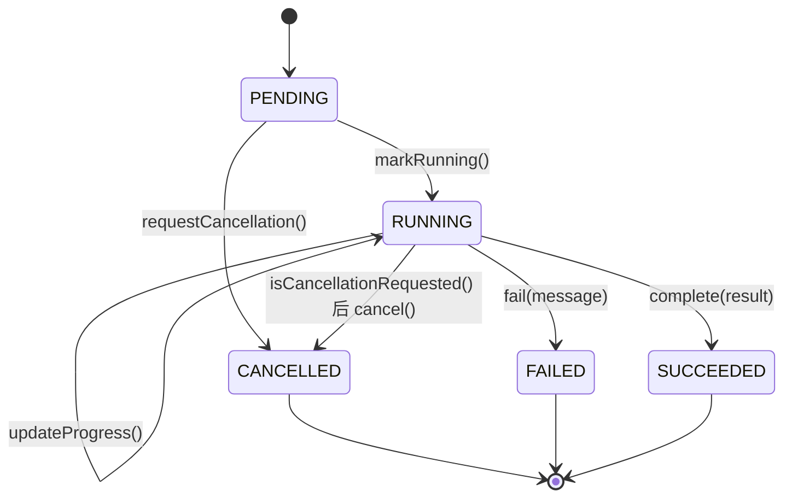
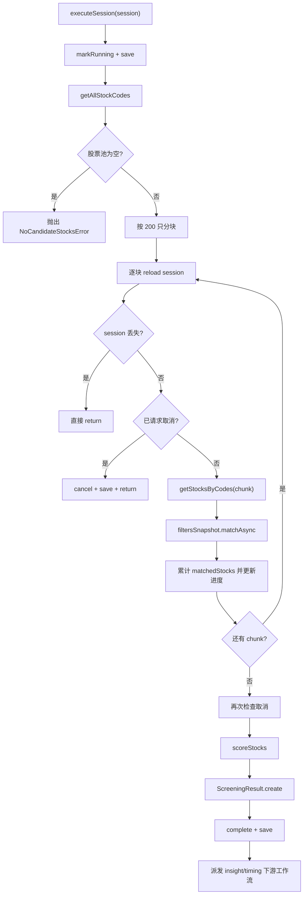
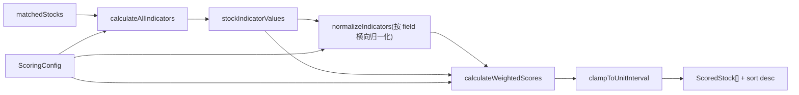
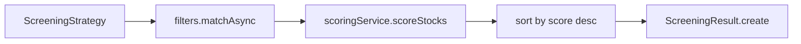
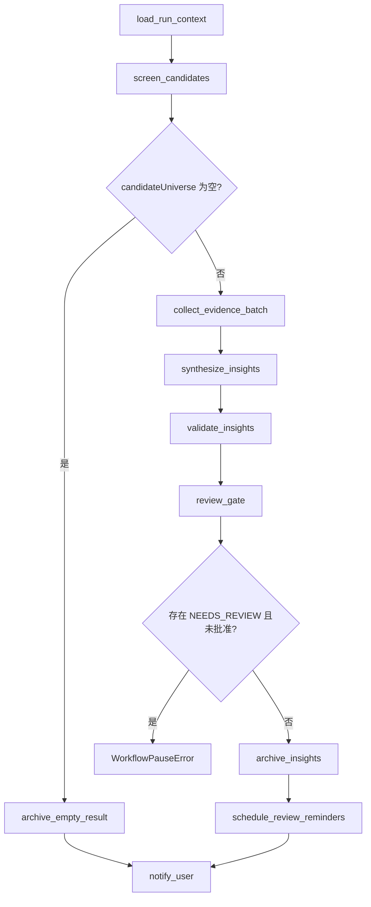

# 股票筛选代码导读

这批文档由 `$workflow-viz` 生成图形骨架后，再补上人工导读得到。

`insights/` 目录更适合“看图定位结构”，但自动评分会把错误类、构造函数或帮助函数误判成主入口，所以建议先读本页，再按顺序点开细页。

## 先建立 4 个心智模型

1. Web 端和 tRPC 并不直接执行筛选，只负责创建一个 `PENDING` 的 `ScreeningSession`。
2. 真正的筛选执行发生在后台 `screening-worker` 轮询里，而不是 `screeningRouter.executeStrategy` 里。
3. `ScreeningSession` 是“异步任务快照 + 状态机 + 结果快照”，不是筛选算法本身。
4. 一次筛选成功后不会在此结束，还会继续触发筛选洞察和择时两个下游工作流。

## 建议阅读顺序

1. 先看 worker 和 session，理解异步执行模型。
   [worker 自动图](./insights/workers-screening-worker/workers-screening-worker.md)
   [session 自动图](./insights/aggregates/screening-session.md)
2. 再看执行核心，理解“怎么真正跑一轮筛选”。
   [execution service 自动图](./insights/screening-execution-service/screening-execution-service.md)
3. 然后看打分服务，理解“筛出来之后怎样算分”。
   [scoring service 自动图](./insights/services-scoring-service/services-scoring-service.md)
4. 如果你想补齐领域模型，再看策略聚合根。
   [strategy 自动图](./insights/aggregates/screening-strategy.md)
5. 最后看 LangGraph，下游洞察链路会把筛选结果再加工成研究洞察。
   [pipeline graph 自动图](./insights/langgraph-screening-insight-pipeline-graph/langgraph-screening-insight-pipeline-graph.md)

## 总体流程

把这张图记住以后，再回源码就不容易把“入队”和“执行”混在一起。

## 哪几个文件最容易误解

- `src/server/api/routers/screening.ts`
  这是应用层入口，只做输入校验、权限判断、仓储装配和 enqueue，不做真正的股票扫描。
- `tooling/workers/screening-worker.ts`
  这是后台执行壳层。它每轮总是先尝试恢复 `RUNNING` 会话，再领取新的 `PENDING` 会话。
- `src/server/application/screening/screening-execution-service.ts`
  这是线上真实筛选主流程。分块拉股票、检查取消、过滤、评分、落库、触发下游，都在这里。
- `src/server/domain/screening/aggregates/screening-session.ts`
  这是状态和结果快照的中心。取消不是立刻中断执行线程，而是先打标记，再由 worker 在下一次检查时收敛。
- `src/server/domain/screening/services/scoring-service.ts`
  真正难点不在“加权求和”，而在“先按当前候选集合做归一化，再按方向翻转，再裁剪到 `[0,1]`”。
- `src/server/infrastructure/workflow/langgraph/screening-insight-pipeline-graph.ts`
  这是筛选后的第二阶段。它不是补充日志，而是新的 LangGraph 工作流。

## 一条最重要的区分

- `ScreeningStrategy.execute`
  这是领域层里的“纯业务骨架”，表达同步语义上的“过滤 -> 评分 -> 排序”。
- `ScreeningExecutionService.executeSession`
  这是线上真实运行路径，负责异步任务状态、分块扫描、取消、异常、持久化和下游派发。

如果你把这两个 `execute` 混成一个概念，后面很多代码都会看起来很怪。

## Worker 循环怎么读

这一层的关键不是算法，而是执行策略：

- 它优先处理“宕机恢复”而不是“新任务吞吐”。
- 它自己不做筛选计算，只把机会交给 `ScreeningExecutionService`。
- `SIGINT` 和 `SIGTERM` 会把 `shuttingDown` 置为真，并断开数据库连接。

## Session 状态机怎么读

这里最值得记住的不是状态名，而是两个细节：

- 对 `PENDING` 会话调用 `requestCancellation()` 会立即变成 `CANCELLED`。
- 对 `RUNNING` 会话调用 `requestCancellation()` 只会设置 `cancellationRequestedAt`，真正 `cancel()` 要等执行流程下次主动检查。

还有一个很容易漏掉的点：`complete()` 只保留前 50 个 `topStocks` 的完整 `ScoredStock`，剩余命中股票只保留代码到 `otherStockCodes`。

## ExecutionService 真正复杂在哪里

读这个文件时，建议把方法分成两组：

- 入队方法：`enqueueStrategyExecution`、`enqueueRetry`、`requestCancellation`
- 执行方法：`executeRecoverableRunningSession`、`executeNextPendingSession`、`executeSession`

再记住 4 个实现细节：

- 过滤阶段不是一次性扫完全市场，而是每 200 只股票一块处理。
- 每个 chunk 前都会重新从仓储里读一遍 session，这就是取消能够生效的原因。
- `SessionMemoizedHistoricalDataProvider` 会按 `stockCode + indicator + years` 做会话内缓存，避免过滤和评分重复打 Python 服务。
- 下游派发是 best-effort。派发失败会记日志，但不会把这次筛选结果改成 `FAILED`。

## 打分服务怎么读

这部分最容易误解的地方有 5 个：

- 归一化是“横向”做的。
  针对同一批 `matchedStocks` 的某个字段一起归一化，不是拿单只股票和全市场常模比较。
- 缺失值和非有限值直接记为 `0`。
- `Z_SCORE` 不是直接输出 z 值，而是先算 z score，再用 sigmoid 压到 `0-1`。
- `DESC` 不是换排序方向，而是在归一化后执行 `1 - normalized`。
- 最终总分还会再次 `clamp` 到 `[0,1]`。

## 为什么 Strategy 看起来和线上执行重复

`ScreeningStrategy.execute` 的存在很合理，但它表达的是“聚合根拥有完整筛选语义”的领域模型，不等于生产路径就直接调用它。

把它理解成“纯业务骨架”就顺了：

- 做 CRUD、模板复制、业务不变式校验时，看 `ScreeningStrategy`
- 做真实异步执行、取消、进度和派发时，看 `ScreeningExecutionService`

## 下游 LangGraph 怎么读

看这段代码时，先记住 3 件事：

- 这个图只接受 `SUCCEEDED` 的 `ScreeningSession`，否则 `loadSessionOrThrow` 会直接报领域错误。
- `WorkflowPauseError` 在这里不是异常路径，而是“等人工 review 后再恢复”的控制流。
- 这条链路把筛选结果变成了新的洞察资产：
  `candidateUniverse -> evidenceBundle -> insightCards -> archiveArtifacts / reminderIds / notificationPayload`

## 看源码时最值钱的几个问题

- “现在是在入队，还是已经在真正执行？”
- “这一步改的是 session 状态，还是在算筛选结果？”
- “这次取消是立即生效，还是只打标记等下一轮检查？”
- “归一化是按单只股票算，还是按当前命中集合横向算？”
- “这段代码是在筛选主链路里，还是已经进入筛选后的洞察工作流？”

只要你边读边回答这 5 个问题，股票筛选这一块会快很多。
