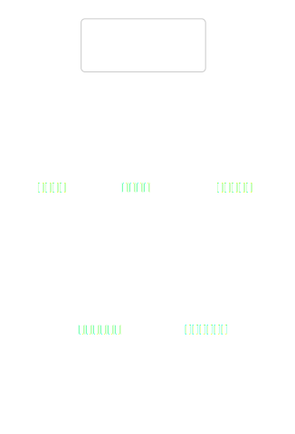
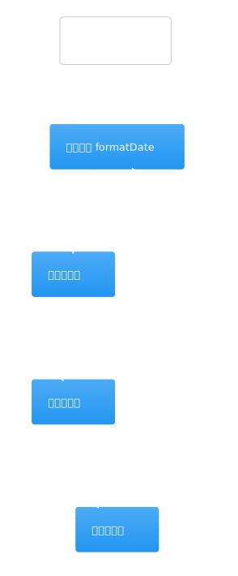
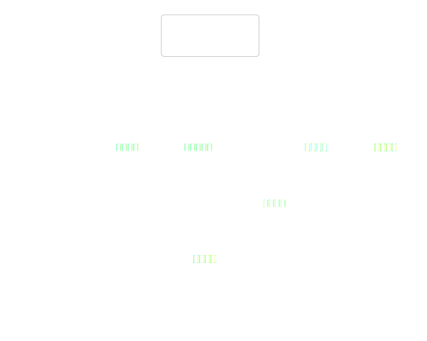
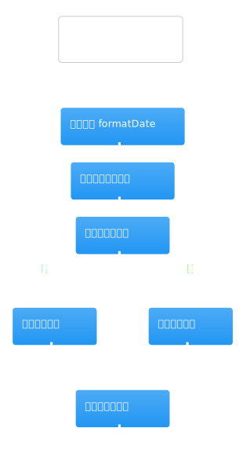
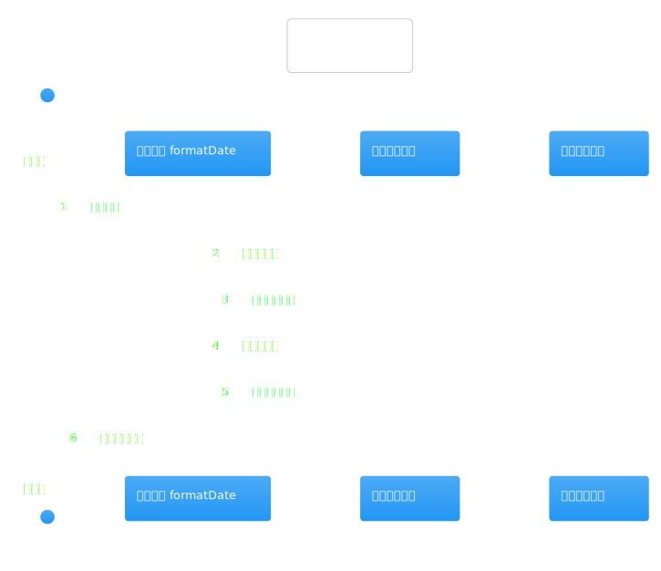
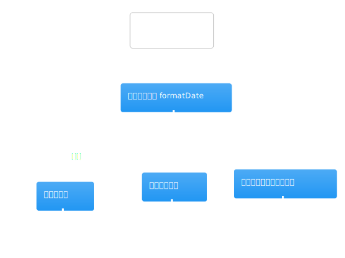
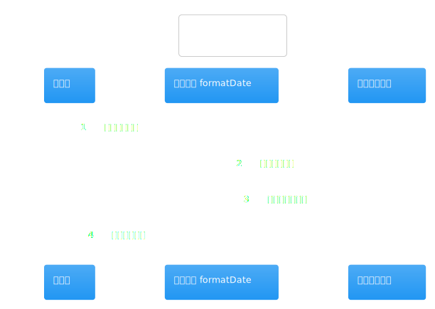
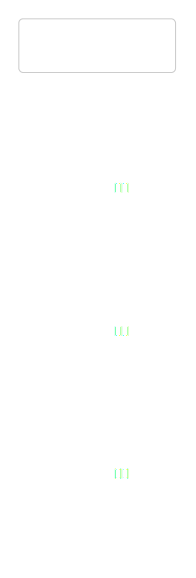

# 热点洞察：company-research-client.tsx

- 源文件: `src/app/company-research/company-research-client.tsx`
- 热点分数: `78`
- 为什么难: 同一个组件同时承载表单状态、历史 run 列表、取消动作、URL 查询参数回填和启动后的跳转。
- 建议先看函数: `CompanyResearchClient`、`handleStart`、`CompanyRunCard`

这页只回答一个问题: 用户在页面上填的内容，最终是怎样变成一次公司研究 run 的。

## 先带着这 3 个问题看图

1. `handleStart()` 在发请求前到底做了哪些输入清洗？
2. start / cancel 成功之后，哪些 query 会被重新拉取？
3. “当前在跑什么、是否可以取消、应该跳去哪里看结果”是怎样在页面里组织的？

## 架构图组

### 架构总览图

图前说明：把这个组件看成“公司研究前台控制台”。它一边收集表单，一边展示最近 20 次 run，并通过 tRPC 把动作交给 `api.workflow.*`。

图后解读：这张图主要帮你确认边界。页面本身不做研究逻辑，它只负责把用户输入整理成 payload，并在成功后跳到 `/workflows/{runId}`。

### 模块拆解图

图前说明：内部可以粗分成三块: 表单输入区、运行历史区、单条运行卡片。

图后解读：真正最值得读的是 `handleStart()`。其余大部分状态变量都在为它服务，例如补充链接、must-answer questions 和 freshness window。

### 依赖职责图

图前说明：先看清这个组件真正依赖的东西只有三类: router、tRPC hooks、以及本地输入状态。

图后解读：最重要的依赖是 `api.workflow.startCompanyResearch.useMutation` 和 `api.workflow.listRuns.useQuery`，前者启动 run，后者让页面能回看最近一次研究。

## 主流程活动图

### 主流程活动图

图前说明：对照源码时，优先看 `handleStart()` 这一段。它会先校验 `companyName`，再依次清洗 supplemental URLs、focus concepts 和 `researchPreferences`。

图后解读：活动图最值得记住的是两件事。第一，页面不会直接构造 task contract，只是把研究偏好原样传下去。第二，启动成功后会先 invalidate 列表，再跳转到 run 详情页。

## 协作顺序图

### 协作顺序图

图前说明：顺序图里请重点看 “用户点击开始判断 -> mutation 成功 -> invalidate runs -> router.push” 这一条线。

图后解读：如果你在排查“为什么页面没刷新”或“为什么没有跳转”，先回来看这张图对应的几个异步回调。

## 分支判定图

### 分支判定图

图前说明：这页真正的分支集中在 `handleStart()` 里，例如公司名为空时直接返回、研究偏好全部为空时不传 `researchPreferences`。

图后解读：这张图可以帮你快速判断“页面漏传参数”到底是表单没填、还是被组件主动裁掉了。

## 状态图

### 状态图

图前说明：页面状态可以按“编辑表单 -> 请求进行中 -> 已跳转 / 列表刷新”来理解，而不是把几十个 `useState` 当成几十种业务状态。

图后解读：如果读这个文件时感觉状态很多，先把它们分成两类: 表单输入状态和服务端运行状态，阅读压力会小很多。

## 异步/并发图

### 异步/并发图

图前说明：异步点主要是两个 mutation 和一个 runs query，没有更深的并发业务逻辑。

图后解读：这也是为什么这个文件虽然不承载研究逻辑，但仍然难读: UI 状态和请求回调混在一个组件里。

## 数据/依赖流图

### 数据/依赖流图

图前说明：顺着“输入框 -> `handleStart()` -> `startCompanyResearch` payload -> run 详情页”这条线看，最容易建立心智模型。

图后解读：如果你只想确认某个字段有没有被传给后端，这张图比直接翻 JSX 更省时间。
