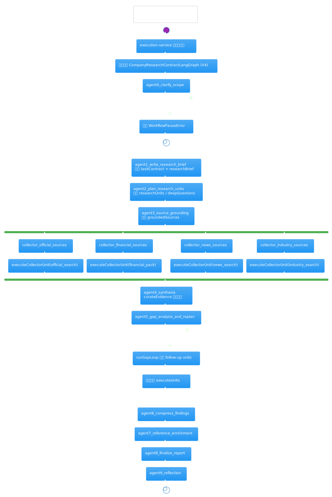

# 公司研究代码阅读导览

这份文档的目标不是替代源码，而是先帮你建立一张“公司研究 V4 到底怎么跑”的地图，再回去按问题读代码。

## 本次扫描识别出的 7 个热点

| 文件 | 分数 | 先回答什么问题 |
| --- | --- | --- |
| `company-research-workflow-service.ts` | 85 | `researchUnits` 是怎么规划、执行、补洞、收束的？ |
| `company-research-agent-service.ts` | 82 | 证据为什么会被筛掉、补齐、最后变成 verdict？ |
| `command-service.ts` | 81 | run 是怎么创建并绑定到公司研究模板的？ |
| `company-research-client.tsx` | 78 | 页面到底把哪些输入送进了工作流？ |
| `company-research-graph.ts` | 77 | 当前主路径是哪一代图，pause/fan-out/gap loop 在哪？ |
| `research-tool-registry.ts` | 68 | 网页搜索、页面抓取、财务 pack 是怎样统一成一个门面的？ |
| `research-workflow-kernel.ts` | 65 | task contract、brief、unit plan、gap analysis 是怎样被规划出来的？ |

## 一句话心智模型

当前最值得关注的是 V4，也就是 `CompanyResearchContractLangGraph`。它把“澄清范围 -> 写 brief -> 规划 research units -> fan-out 采集 -> 证据整合 -> gap loop -> 报告定稿”这条链路串起来；真正执行业务细节的是 `CompanyResearchWorkflowService`，而不是图文件本身。

## 先看这两张人工校准图

这两张图不是脚手架占位图，而是按当前源码主路径手工整理的。

### 公司研究 V4 主路径

读这张图时先抓住两件事：

- V4 不再是“一个大 Agent 一把梭”，而是先规划 `researchUnits`，再由四个 collector 节点显式 fan-out。
- `gapAnalysis` 不在首轮采集主干里，而是在 `agent4_synthesis` 之后进入补洞循环。

### `industry_search` 实际执行链路

这张图最重要的是把三个名字对齐：

- `industry_search`：研究单元里的 capability 名。
- `collector_industry_sources`：LangGraph 里的显式节点名。
- `industry_sources`：证据最终落到 `collectedEvidenceByCollector` 时使用的 collectorKey。

## 按问题找文档

- 想知道“点下开始判断按钮之后发生了什么”：先看 [前端入口](./company-research-client/company-research-client.md)，再看 [工作流启动入口](./workflow-command-service/workflow-command-service.md)。
- 想知道“现在到底走的是哪一代公司研究图”：看 [LangGraph 总控页](./langgraph-company-research-graph/langgraph-company-research-graph.md)。
- 想知道“研究单元是怎么被计划并执行的”：先看 [workflow service](./intelligence/company-research-workflow-service.md)，再回 [kernel](./intelligence/research-workflow-kernel.md)。
- 想知道“数据和证据是怎么拿到的”：看 [tool registry](./intelligence/research-tool-registry.md)。
- 想知道“证据怎么变成答案和 verdict”：看 [agent service](./intelligence/company-research-agent-service.md)。

## 推荐阅读顺序

1. 先看 [前端入口](./company-research-client/company-research-client.md)，确认页面提供了哪些输入。
2. 再看 [工作流启动入口](./workflow-command-service/workflow-command-service.md)，确认 run 是怎样落到公司研究模板上的。
3. 接着看 [LangGraph 总控页](./langgraph-company-research-graph/langgraph-company-research-graph.md)，只盯 V4。
4. 然后精读 [workflow service](./intelligence/company-research-workflow-service.md)，这是当前最关键的一页。
5. 回头看 [kernel](./intelligence/research-workflow-kernel.md)，理解 brief、unit plan 和 gap analysis 的规则来源。
6. 再看 [tool registry](./intelligence/research-tool-registry.md)，理清外部工具边界。
7. 最后看 [agent service](./intelligence/company-research-agent-service.md)，把证据整理、引用补全、问答和 verdict 串起来。

## 当前主路径

如果你只想先搞懂“现在线上的公司研究怎么跑”，按这条链路追最省时间：

1. `src/app/company-research/company-research-client.tsx:295`
   `handleStart()` 会把公司名、关键问题、补充链接和 `researchPreferences` 整理成 `startCompanyResearch` 的输入。
2. `src/server/application/workflow/command-service.ts:190`
   `startCompanyResearch()` 只做输入整理，真正复杂的是统一入口 `startWorkflow()`。
3. `src/server/application/workflow/command-service.ts:428`
   `startWorkflow()` 负责幂等校验、确保公司研究模板存在，并创建 run。
4. `src/server/infrastructure/workflow/langgraph/company-research-graph.ts:1045`
   从 `CompanyResearchContractLangGraph` 开始读 V4，不要先陷进 V1/V2/V3。
5. `src/server/infrastructure/workflow/langgraph/company-research-graph.ts:1122`
   `agent2_plan_research_units` 委托 `CompanyResearchWorkflowService.planUnits()`。
6. `src/server/infrastructure/workflow/langgraph/company-research-graph.ts:1235-1249`
   图层在首轮采集后走 `reference_enrichment -> finalize_report -> reflection`，补洞循环发生在它之前。
7. `src/server/application/intelligence/company-research-workflow-service.ts:358`
   `planUnits()` 先做 concept mapping 和 deep questions，再向 kernel 申请 `researchUnits`。
8. `src/server/application/intelligence/company-research-workflow-service.ts:393`
   `runCollectorUnit()` 才是真正的采集执行器，会把 capability 映射成 collectorKey、查询词和工具调用。
9. `src/server/application/intelligence/company-research-workflow-service.ts:798`
   `runGapLoop()` 会在首轮证据整合之后压缩 findings、识别缺口、追加 follow-up units。
10. `src/server/application/intelligence/company-research-agent-service.ts:1326`
    `curateEvidence()` 负责打分、去重、生成 references，是“证据收束”的核心。
11. `src/server/application/intelligence/company-research-workflow-service.ts:970`
    `finalizeReport()` 最终把 findings、verdict、confidenceAnalysis、reflection 汇成结果。

## `industry_search` 怎么跑

如果你关心“行业研究”这一支，直接追下面几处：

1. `src/server/application/intelligence/research-workflow-kernel.ts:421`
   `buildUnitPlanFallback()` 默认会生成 `industry_landscape`，它的 capability 就是 `industry_search`。
2. `src/server/application/intelligence/research-workflow-kernel.ts:789`
   `planResearchUnits()` 会用大模型规划，但最终仍会裁剪到允许的 capability 集合里。
3. `src/server/infrastructure/workflow/langgraph/company-research-graph.ts:1182`
   `collector_industry_sources` 会从 `researchUnits` 里找到 `industry_search` 对应的 unit。
4. `src/server/application/intelligence/company-research-workflow-service.ts:494`
   `runCollectorUnit()` 把这个 unit 映射成 `collectorKey = industry_sources`，并构造行业格局检索词。
5. `src/server/application/intelligence/research-tool-registry.ts:117`
   `searchWeb()` 会并发搜索多个 query、按 canonical URL 去重，再把网页内容压成简短摘要。
6. `src/server/application/intelligence/company-research-agent-service.ts:1326`
   `curateEvidence()` 会把行业证据和其他 collector 的材料一起打分、去重、裁剪成最终引用集合。

## 为什么这块代码容易读乱

- 同一主链横跨 7 层：前端表单、工作流命令、LangGraph、workflow service、kernel、tool registry、agent service。
- `company-research-graph.ts` 同时放了 V1/V2/V3/V4 四代实现，很容易把历史路径和当前路径混在一起。
- `company-research-agent-service.ts` 同时保留了旧的直接采集逻辑和新的后处理逻辑，名字相近但职责已经变了。
- `runGapLoop()` 让主流程从“首轮采集”回到“追加 follow-up units”，所以整条链不是一眼就能看懂的线性 DAG。

## 首次阅读时可以先跳过什么

- `LegacyCompanyResearchLangGraph`：除非你在定位旧模板行为。
- `CompanyResearchAgentService.collect*Sources()` 这类旧 collector：当前 V4 主路径更值得先看 `groundSources`、`curateEvidence`、`enrichReferences`、`answerQuestions`、`buildVerdict`。
- 自动生成热点页里的“主入口”字段：它是静态启发式结果，不一定等于业务上的真实主执行线。

## 读源码时的止损策略

- 每次只追一个问题，不要试图一次把 7 层全读完。
- 遇到 `researchUnits` 时，先问自己这是“规划”还是“执行”；前者看 kernel，后者看 workflow service。
- 遇到 `collector_*`、`official_sources`、`industry_sources` 这类名字时，先分清楚它是节点名、capability 还是 collectorKey。
- 遇到“为什么会暂停 / 为什么会追加新单元”这类问题时，优先回 LangGraph 和 workflow service，不要先钻进 agent service。
