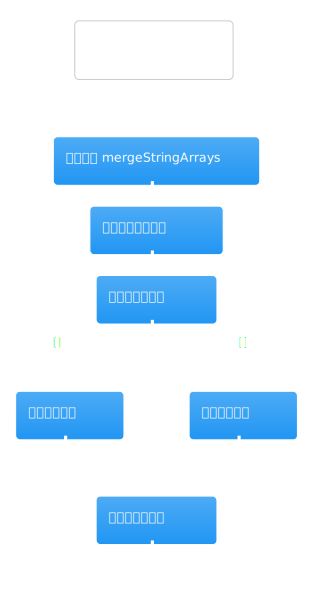
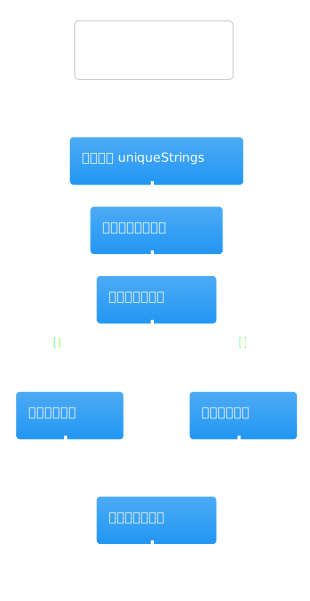

# 行业研究理解导图

这组文档对应的是当前仓库里“行业研究 / 公司研究”最容易绕晕的一条主链。先记住一句话：现行主路径已经不是“单个大 Agent 一把梭”，而是“前端发起运行 -> 工作流模板建 run -> LangGraph 选中最新版本图 -> 工作流服务计划/执行研究单元 -> Agent 服务负责证据整理与结论收束”。

## 当前主路径

1. 页面入口：[`../company-research-client/company-research-client.md`](../company-research-client/company-research-client.md)
   `CompanyResearchClient.handleStart` 把表单字段组装成 `startCompanyResearch` 的输入，并把 `researchPreferences`、`idempotencyKey` 一起传下去。
2. 创建运行：[`../workflow-command-service/workflow-command-service.md`](../workflow-command-service/workflow-command-service.md)
   `WorkflowCommandService.startCompanyResearch` 只做两件事：组装 query，以及确保 `company_research_center` 模板存在并创建 run。
3. 选择当前图版本：`src/server/application/workflow/execution-service.ts` + `src/server/infrastructure/workflow/langgraph/graph-registry.ts`
   `WorkflowGraphRegistry` 默认取同一 `templateCode` 的最高版本，所以当前主路径会落到 `CompanyResearchContractLangGraph`，也就是 v4。
4. 图编排：[`../langgraph-company-research-graph/langgraph-company-research-graph.md`](../langgraph-company-research-graph/langgraph-company-research-graph.md)
   v4 负责把研究拆成澄清、写 brief、计划研究单元、并行采集、补洞、压缩、补引用、最终成文几个阶段。
5. 执行核心：[`./company-research-workflow-service.md`](./company-research-workflow-service.md)
   这里才是真正的“当前行业研究执行核心”，负责计划研究单元、并发执行采集器、补洞重规划和最终报告生成。
6. 策略内核与工具边界：[`./research-workflow-kernel.md`](./research-workflow-kernel.md) + [`./research-tool-registry.md`](./research-tool-registry.md)
   前者决定“要做哪些研究单元”，后者决定“这些单元如何触达 Firecrawl / Python 金融数据 / DeepSeek 摘要能力”。
7. 旧 Agent 与仍在复用的后处理：[`./company-research-agent-service.md`](./company-research-agent-service.md)
   这个文件里既有老版本直接采集逻辑，也有当前路径仍在复用的 `groundSources`、`curateEvidence`、`enrichReferences`、`answerQuestions`、`buildVerdict`。

## 先看这两张图

先看 v4 图编排，建立“现行主流程到底有几段”的心智模型：

这张图最重要的阅读点不是每个节点的细节，而是三段结构：

- 前置阶段：`agent0_clarify_scope` -> `agent1_write_research_brief` -> `agent2_plan_research_units`
- 并行采集阶段：`agent3_source_grounding` 后 fan-out 到四个 collector
- 收束阶段：`agent4_synthesis` 之后进入补洞、压缩、补引用、最终报告

再看执行核心，理解真正干活的逻辑在哪一层：

读这张图时请重点盯住四个方法：

- `planUnits`：把 brief 变成可执行研究单元
- `executeUnits`：按依赖拓扑分批并发执行研究单元
- `runGapLoop`：压缩已有结论并判断是否要追加 follow-up 单元
- `finalizeReport`：把证据、结论、反思、合同评分合成最终报告

## 真正的“industry_search”在哪里

如果你的目标是理解“行业研究”本身，不要被大文件吓住，直接追下面这四个位置：

1. `research-workflow-kernel.ts`
   默认计划里有 `industry_landscape` 单元，`capability` 是 `industry_search`，`role` 是 `industry_collector`，产物类型是 `industry_evidence_bundle`。
2. `company-research-graph.ts`
   v4 的 `collector_industry_sources` 会从 `state.researchUnits` 找到 `industry_search` 单元，然后调用 `workflowService.executeCollectorUnit(...)`。
3. `company-research-workflow-service.ts`
   `runCollectorUnit` 会把 `industry_search` 映射成 `industry_sources`，通过 `buildCollectorQueries(...)` 生成检索词，再调用 `researchToolRegistry.searchWeb(...)`，最后把网页结果映射成证据。
4. `company-research-agent-service.ts`
   这里也有 `collectIndustrySources(...)`，但它属于老路径。当前主路径里更值得看的，是它的证据去重、引用补全、问答和 verdict 生成逻辑。

## 为什么这块代码难读

- 同一文件里并存 4 代图：`company-research-graph.ts` 同时放了 V1/V2/V3/V4，第一次读很容易把历史实现和当前实现混在一起。
- “规划”和“执行”分层了：`research-workflow-kernel.ts` 决定研究单元长什么样，`company-research-workflow-service.ts` 决定怎么跑，`research-tool-registry.ts` 只负责外部工具访问。
- 老 Agent 还没彻底退休：`company-research-agent-service.ts` 既包含 V1/V2 的直接采集器，又包含 V4 仍在复用的整理和收束能力。
- 补洞循环让主线回环：`runGapLoop` 会根据 `compressResearchFindings` + `analyzeResearchGaps` 的结果追加 follow-up 单元，所以流程不是单纯的线性 DAG。

## 推荐阅读顺序

1. [`../company-research-client/company-research-client.md`](../company-research-client/company-research-client.md)
   先确认前端到底把哪些字段送进工作流。
2. [`../workflow-command-service/workflow-command-service.md`](../workflow-command-service/workflow-command-service.md)
   看 run 是怎么创建的，以及为什么默认会补齐最新模板。
3. [`../langgraph-company-research-graph/langgraph-company-research-graph.md`](../langgraph-company-research-graph/langgraph-company-research-graph.md)
   只先看 v4；除非你在排查兼容问题，否则先忽略 v1/v2/v3。
4. [`./company-research-workflow-service.md`](./company-research-workflow-service.md)
   这是当前最值得精读的一页。
5. [`./research-workflow-kernel.md`](./research-workflow-kernel.md)
   回头理解 capability、fallback、acceptanceCriteria 是怎么定出来的。
6. [`./research-tool-registry.md`](./research-tool-registry.md)
   最后再看外部工具边界，避免过早陷入 Firecrawl/Python 细节。
7. [`./company-research-agent-service.md`](./company-research-agent-service.md)
   带着“哪些逻辑是历史遗留、哪些逻辑仍在复用”的问题去读，最不容易迷路。

## 读源码时的取舍建议

- 想理解当前线上路径：优先看 `CompanyResearchContractLangGraph`、`CompanyResearchWorkflowService`、`research-workflow-kernel.ts`。
- 想理解“行业研究单元”具体怎么搜：优先看 `industry_search` 在 kernel、graph、workflow service 三层的传递。
- 想理解引用为什么会被裁剪或补全：去看 `CompanyResearchAgentService.curateEvidence` 和 `enrichReferences`。
- 想理解为什么会暂停：去看 v4 图里的 `agent0_clarify_scope`，它会在需要澄清时抛 `WorkflowPauseError`。

从这份导图继续往下读时，建议每次只追一个问题，例如“industry_search 是怎么被计划并执行的”或“gap loop 为什么会追加新单元”。这样最容易把 4 代实现分开。
