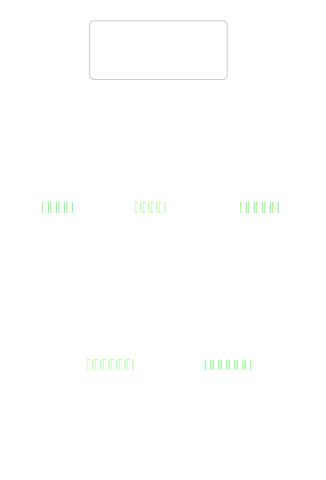
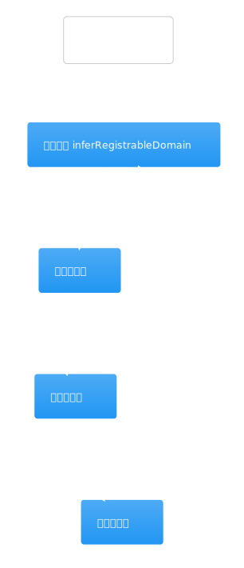
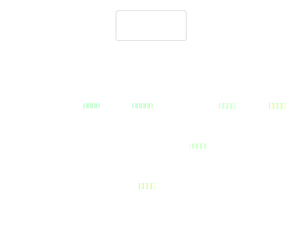
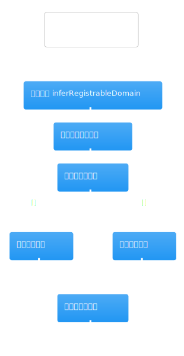
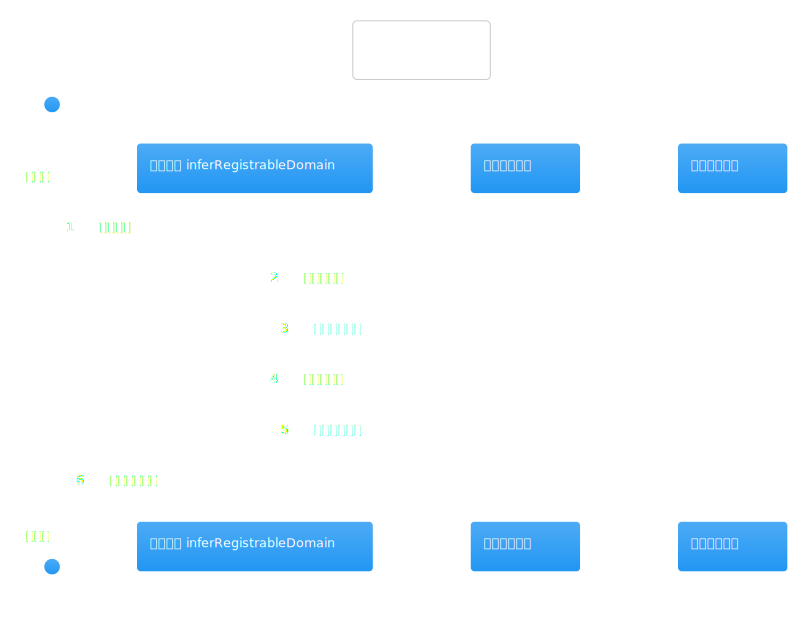
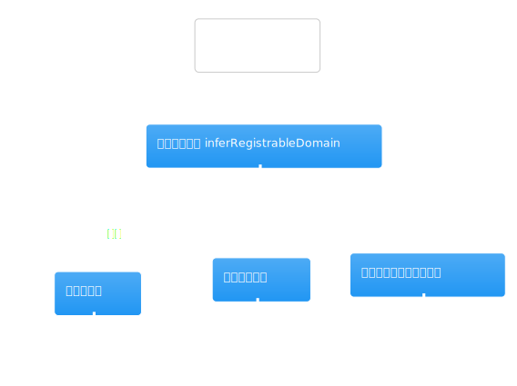
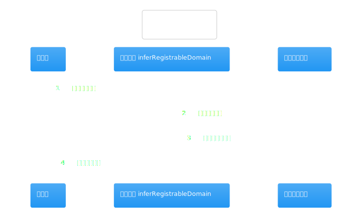
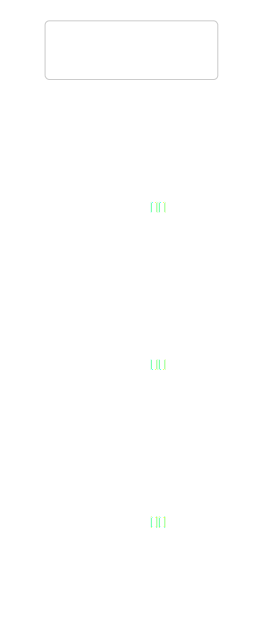

# 热点洞察：company-research-agent-service.ts

- 源文件: `src/server/application/intelligence/company-research-agent-service.ts`
- 热点分数: `82`
- 为什么难: 这个文件同时保留了旧版 collector 逻辑和 V4 仍在复用的后处理逻辑，很容易把“采集”和“证据收束”混为一谈。
- 建议先看函数: `groundSources`、`curateEvidence`、`enrichReferences`、`answerQuestions`、`buildVerdict`

如果 workflow service 负责把研究跑起来，这个 service 负责把“已经拿回来的材料”整理成可以写进报告的东西。当前 V4 最值得关注的不是旧的 `collect*Sources()`，而是后半段的证据排序、引用补全、问答和 verdict 生成。

## 先带着这 4 个问题看图

1. 官网、补充链接和新闻链接是怎样在 `groundSources()` 里被分类成 first-party / third-party 的？
2. 多个 collector 回来的证据为什么只剩下一小部分进入最终引用集合？
3. 哪些引用会触发 `enrichReferences()` 的二次抓取？
4. `answerQuestions()` 和 `buildVerdict()` 分别负责哪一段推理，而不是互相重复？

## 架构图组

### 架构总览图

图前说明：把这个 service 看成“证据后处理工厂”。上游是 workflow service 交来的 `collectedEvidenceByCollector`，下游是最终报告里的 findings、references 和 verdict。

图后解读：这张图最重要的结论是，agent service 更像“材料整理 + 研究判断”层，而不是“流程调度”层。

### 模块拆解图

图前说明：内部可以粗分成三块: source grounding、证据筛选与引用补强、问答与 verdict 生成。

图后解读：第一次读时，不要试图把所有旧 collector 都看完。当前主路径只需要盯住 `groundSources` 之后这一半。

### 依赖职责图

图前说明：这里依赖了四类外部能力: `FirecrawlClient` 负责抓取网页详情，`PythonIntelligenceDataClient` 负责结构化金融数据，`DeepSeekClient` 负责回答问题和生成 verdict，`ConfidenceAnalysisService` 负责置信度评估。

图后解读：如果你能先分清这四类依赖的职责，后面再看长文件就不会觉得它“像一个黑盒”。

## 主流程活动图

### 主流程活动图

图前说明：当前主路径最值得对照的活动线是 `groundSources -> curateEvidence -> enrichReferences -> answerQuestions -> buildVerdict -> analyzeConfidence`。

图后解读：活动图揭示了一个很重要的阅读顺序: 先把证据集合整理干净，再去问答和下 verdict，而不是一边采集一边直接产出判断。

## 协作顺序图

### 协作顺序图

图前说明：顺序图里重点看 `curateEvidence()` 和 `enrichReferences()` 的交互，它们最能解释“为什么最后引用和原始证据数量差很多”。

图后解读：如果你在排查“某条证据明明抓到了，为什么没进最终报告”，先回来看这张图，再去看 evidence score 和 canonical URL 去重。

## 分支判定图

### 分支判定图

图前说明：关键分支主要有三类: 来源归类分支、证据筛选分支、引用补强分支。尤其是 `enrichReferences()`，只有 snippet 或 extracted fact 太短的非 financial 引用才会再抓一次。

图后解读：这张图很适合回答“为什么某些引用被补全，另一些没有被补全”。

## 异步/并发图

### 异步/并发图

图前说明：这里最明显的并发点在 `enrichReferences()` 的 `Promise.all`，它会并行抓取需要补全的引用页面。

图后解读：如果你在排查页面抓取慢或部分引用补全失败，这张图能帮你快速定位真正的异步瓶颈。

## 数据/依赖流图

### 数据/依赖流图

图前说明：顺着 `collectedEvidenceByCollector -> deduped evidence -> references -> question findings -> verdict -> confidenceAnalysis` 这条线看图最清楚。

图后解读：如果你只想回答“材料是怎么一步步变成最终结论的”，这张图比翻完整文件更省时间。
