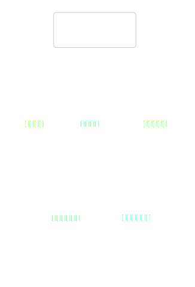
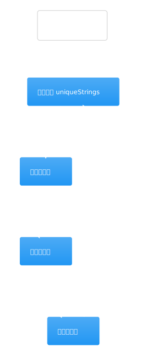
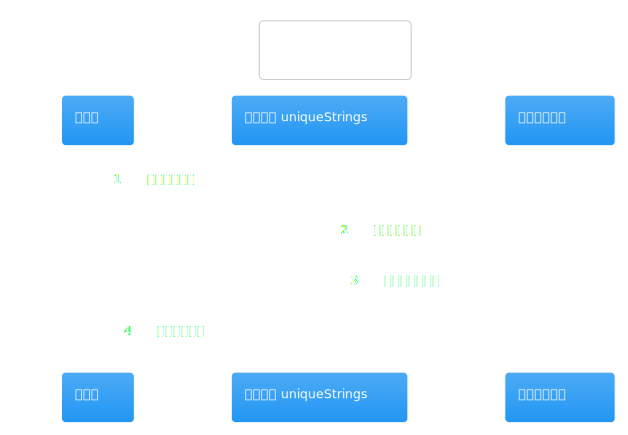
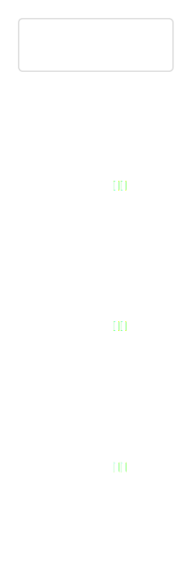

# 热点洞察：company-research-workflow-service.ts

- 源文件: `src/server/application/intelligence/company-research-workflow-service.ts`
- 热点分数: `85`
- 为什么难: 它既负责规划研究单元，又负责真实采集执行、并发批处理、gap loop 和最终报告收束，是 V4 的执行中枢。
- 建议先看函数: `planUnits`、`runCollectorUnit`、`executeUnits`、`runGapLoop`、`finalizeReport`

如果 LangGraph 是“路由表”，那这个 service 就是“执行总控台”。图层只决定当前轮到哪个节点，真正把 `researchInput` 变成 `evidence`、`references`、`findings` 和 `finalReport` 的，是这里。

## 先带着这 4 个问题看图

1. `researchUnits` 是在哪里生成，又在哪里真正被消耗的？
2. capability 是如何映射成 `official_sources / industry_sources / financial_sources / news_sources` 的？
3. 为什么这里既有 `executeCollectorUnit()`，又有 `executeUnits()`？
4. `gap loop` 追加出来的 follow-up units 会怎样并入原来的执行状态？

## 架构图组

### 架构总览图

图前说明：把它看成 V4 的“执行总控台”。上游是 `CompanyResearchContractLangGraph`，下游是 `ResearchToolRegistry` 和 `CompanyResearchAgentService`。

图后解读：这张图最重要的结论是职责分层。workflow service 既不定义图，也不直接决定最终投资立场；它负责把每一步执行起来并把状态接好。

### 模块拆解图

图前说明：内部可以粗分成四块: brief / task contract 构建、研究单元规划、采集执行与补洞、最终报告收束。

图后解读：如果只想搞懂当前主路径，优先读后两块，也就是 `runCollectorUnit`、`executeUnits`、`runGapLoop` 和 `finalizeReport`。

### 依赖职责图

图前说明：这里最重要的三个依赖分别承担三件事: `DeepSeekClient` 做规划/压缩，`ResearchToolRegistry` 负责外部工具访问，`CompanyResearchAgentService` 负责证据整理和结论收束。

图后解读：一旦把这三类依赖分清楚，再看这个文件就不会觉得它“什么都做了”。

## 主流程活动图

### 主流程活动图

图前说明：活动图建议对照 `planUnits -> executeCollectorUnit / executeUnits -> runGapLoop -> compressFindings -> finalizeReport` 这条主线一起看。

图后解读：这张图最值得记住的是“规划和执行分两层”。`planUnits()` 只负责把 brief 变成结构化 unit，真正执行 unit 的是 `runCollectorUnit()` 和 `executeUnits()`。

## 协作顺序图

### 协作顺序图

图前说明：顺序图里请重点看 `runCollectorUnit()` 的交互，因为它最能体现这个 service 的真实职责。

图后解读：以 `industry_search` 为例，这里会先构造 queries，再调用 `researchToolRegistry.searchWeb()`，最后把网页结果映射成 `CompanyEvidenceNote`。

## 分支判定图

### 分支判定图

图前说明：关键分支主要集中在 `runCollectorUnit()` 和 `runGapLoop()`。例如 `financial_pack` 会走 Python pack 分支，而 `page_scrape` 会追加抓取 first-party 页面。

图后解读：如果你遇到“同样是 collector，为什么行为不同”，先回这张图确认当前 capability 走的是哪条分支。

## 状态图

### 状态图

图前说明：这页的状态不是数据库状态，而是运行时快照里的阶段性状态: `researchUnits`、`researchNotes`、`researchUnitRuns`、`gapAnalysis`、`replanRecords`。

图后解读：理解这张图后，再看 `workingState` 和 `snapshot` 这两个局部变量就不容易混淆了。

## 异步/并发图

### 异步/并发图

图前说明：并发重点在 `executeUnits()`。它会按 `dependsOn` 拓扑筛出 ready units，再按 `maxConcurrentResearchUnits` 分批 `Promise.all`。

图后解读：如果你在排查“为什么 follow-up unit 没有立刻执行”或“为什么某些 unit 必须等前面的完成”，就回来看这张图。

## 数据/依赖流图

### 数据/依赖流图

图前说明：顺着 `researchInput -> brief / deepQuestions -> researchUnits -> collectedEvidenceByCollector -> evidence / references -> findings / verdict -> finalReport` 这条线看图最省时间。

图后解读：这张图最适合排查“某个字段为什么没有进最终报告”，尤其是 `researchNotes`、`collectorRunInfo` 和 `compressedFindings`。
