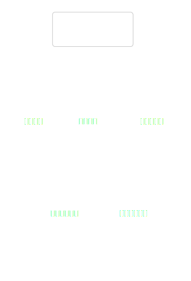
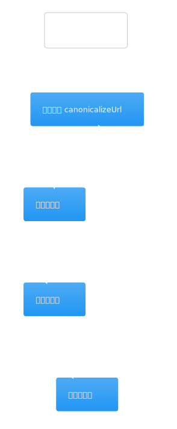
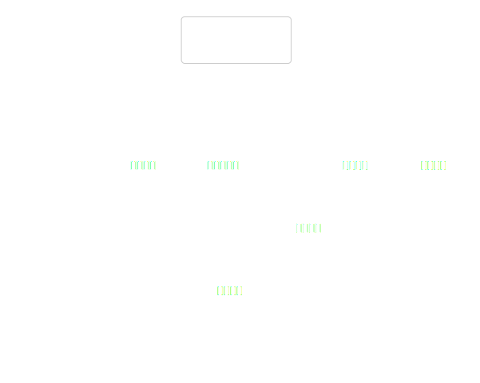
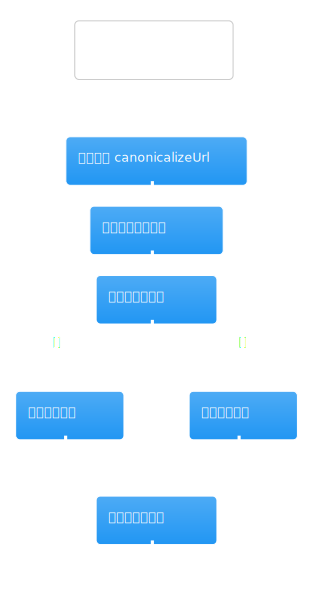
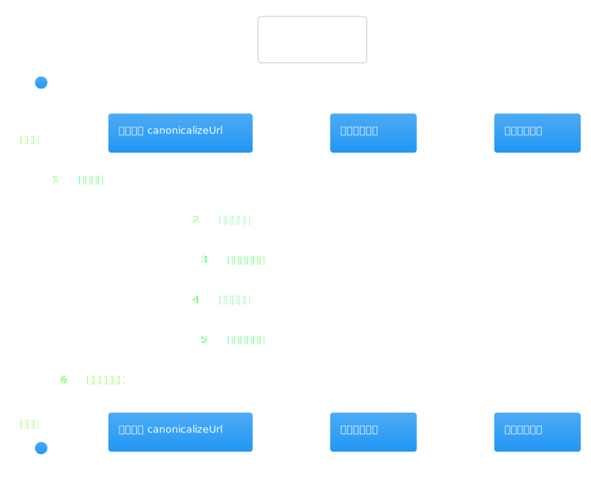
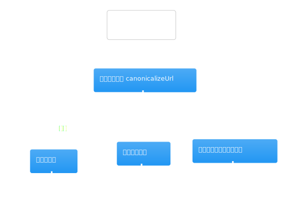
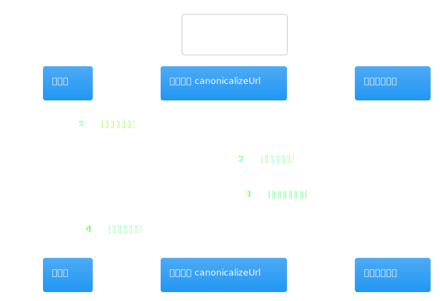
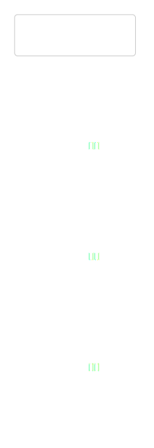

# 热点洞察：research-tool-registry.ts

- 源文件: `src/server/application/intelligence/research-tool-registry.ts`
- 热点分数: `68`
- 为什么难: 它把 Firecrawl、Python intelligence 和 DeepSeek 压缩统一藏在一个薄门面后面，调用方很容易误以为“只是搜一下网页”。
- 建议先看函数: `searchWeb`、`fetchPage`、`getFinancialPack`

这页回答的是“workflow service 说要搜网页、抓页面、拿财务 pack 时，底层到底发生了什么”。它本身不决定研究策略，但决定了研究单元怎样触达外部能力。

## 先带着这 3 个问题看图

1. 同样是“拿网页”，`searchWeb()` 和 `fetchPage()` 的职责差别是什么？
2. 哪些运行时配置会直接让某个工具调用返回空结果？
3. 搜索结果是怎样被 canonicalize、去重和摘要化的？

## 架构图组

### 架构总览图

图前说明：把它看成 workflow service 和外部工具之间的统一门面。调用方只知道“要搜索 / 抓取 / 拿财务数据”，不知道具体 provider 细节。

图后解读：这张图最重要的意义是划边界。外部 provider 的复杂度应该被截在这里，不应该泄漏回 workflow service。

### 模块拆解图

图前说明：这个文件可以分成四块: URL 归一化、网页摘要压缩、网页 / 页面抓取门面、Python 数据门面。

图后解读：如果你只关心公司研究主路径，优先看 `searchWeb()`、`fetchPage()`、`getFinancialPack()` 即可。

### 依赖职责图

图前说明：依赖关系很清晰。`FirecrawlClient` 负责搜索和页面抓取，`PythonIntelligenceDataClient` 负责财务 pack 与其他结构化金融数据，`DeepSeekClient` 负责超长网页内容的压缩摘要。

图后解读：如果你看到研究结果为空，先看 provider 是否被配置和启用，而不是先怀疑上层 planner。

## 主流程活动图

### 主流程活动图

图前说明：主流程活动图最值得对照 `searchWeb()` 看。它会先检查 provider 配置，再并发搜索、canonical 去重、摘要化，最后映射成统一的 `ResearchWebDocument`。

图后解读：活动图揭示了一个关键事实: 搜索结果不是直接原样返回，而是会经过去重和压缩，因此上层拿到的是“研究用文档”，不是原始搜索结果。

## 协作顺序图

### 协作顺序图

图前说明：顺序图里重点看 `searchWeb()` 对多个 query 的处理顺序，以及每条结果在进入返回值前要经过哪些步骤。

图后解读：如果你在排查“为什么 query 发出去了但结果很少”，先确认是 provider 没配、去重裁掉了，还是内容摘要阶段被截断了。

## 分支判定图

### 分支判定图

图前说明：这里最关键的分支都是运行时配置分支，例如 `toolProviders.webSearch !== "firecrawl"` 时直接返回空数组。

图后解读：读这张图时，把“没配置所以空结果”和“搜索有结果但被后续处理裁掉”这两类情况区分开很重要。

## 异步/并发图

### 异步/并发图

图前说明：真正的并发点在 `Promise.all`。`searchWeb()` 会并发跑多个 query，`fetchPage()` 和摘要压缩也都是异步链路。

图后解读：如果你在排查性能瓶颈，这张图通常比看 workflow service 更直接，因为这里才是真正的外部 IO 汇聚点。

## 数据/依赖流图

### 数据/依赖流图

图前说明：按 `query -> Firecrawl result -> canonical URL -> summarized document -> ResearchWebDocument` 这条线看图最容易理解这个门面的价值。

图后解读：这张图适合用来确认“为什么上层看到的是统一字段结构，而不是不同 provider 各自的原始响应”。
