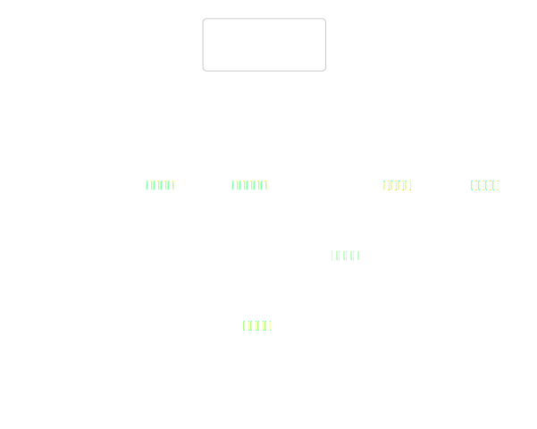
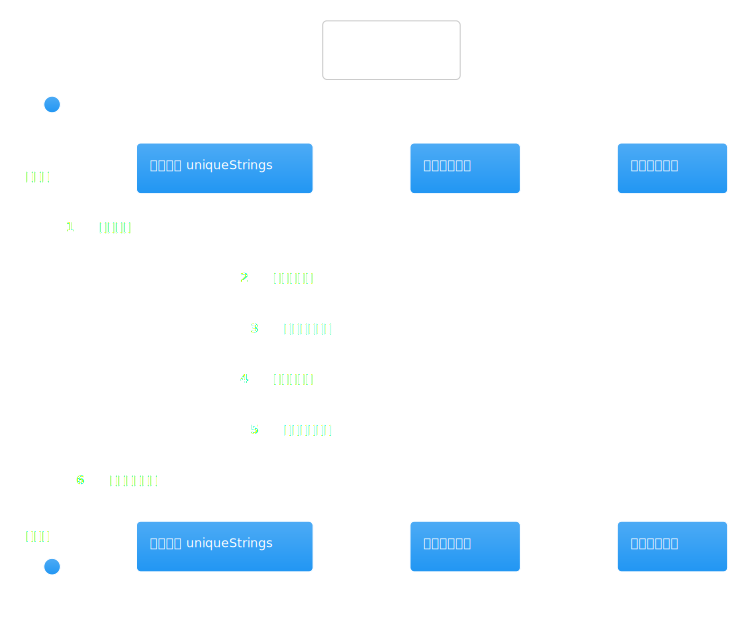
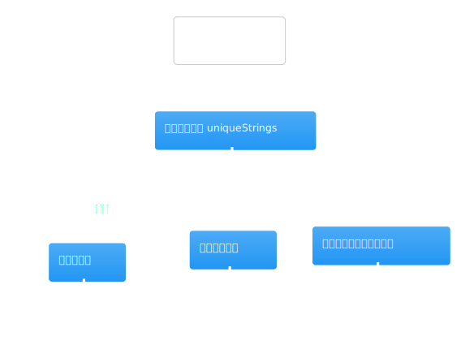

# 热点洞察：research-workflow-kernel.ts

- 源文件: `src/server/application/intelligence/research-workflow-kernel.ts`
- 热点分数: `65`
- 为什么难: 这里没有真正执行任何采集，但几乎所有“研究计划长什么样”的规则都写在这里，而且 LLM 规划和 fallback 规则混在一个文件里。
- 建议先看函数: `clarifyResearchScope`、`writeTaskContract`、`writeResearchBrief`、`planResearchUnits`、`analyzeResearchGaps`、`compressResearchFindings`

把这页理解成“规则内核”会最清楚。它负责把原始研究请求变成结构化的 contract、brief、unit plan 和 gap analysis，但不直接抓网页或生成最终 verdict。

## 先带着这 4 个问题看图

1. 哪些产物是 LLM 规划出来的，哪些是 fallback 规则硬编码出来的？
2. `allowedCapabilities` 是在哪一步被强制裁剪的？
3. `industry_search` 这类默认研究单元是从哪里来的？
4. gap loop 里用到的 follow-up units 是如何受 `maxGapIterations` 和 capability 白名单约束的？

## 架构图组

### 架构总览图

图前说明：把这个文件看成 workflow service 的“规划引擎”。上游是 `CompanyResearchWorkflowService`，下游主要是 `DeepSeekClient` 返回结构化 JSON。

图后解读：这张图能帮你确认一个关键事实: kernel 决定“做什么”，但不决定“怎么抓数据”。

### 模块拆解图

图前说明：内部可以分成三块: fallback 规则、提示词驱动的结构化规划、后续压缩与 gap 分析。

图后解读：第一次读时不用把所有 helper 都看懂，先抓 `buildUnitPlanFallback()`、`planResearchUnits()` 和 `analyzeResearchGaps()` 这三处就够了。

### 依赖职责图

图前说明：这里最重要的依赖只有一个，就是 `DeepSeekClient`。其余复杂度主要来自 prompt 结构和 fallback 规则，而不是外部系统。

图后解读：如果你在问“为什么某次计划长这样”，大概率答案就在 prompt 输入和 fallback 约束里。

## 主流程活动图

### 主流程活动图

图前说明：按“澄清范围 -> 写 task contract -> 写 brief -> 规划 research units -> 压缩 findings -> gap 分析”这条线看最顺。

图后解读：活动图对应的核心理解是，kernel 不会一步产出最终研究结果，而是不断产出下一层可消费的结构化中间件。

## 协作顺序图

### 协作顺序图

图前说明：顺序图里看的是 `DeepSeekClient` 被多次调用的顺序，而不是多系统并发。

图后解读：如果你在排查“为什么 brief 看起来合理，但 units 很奇怪”，通常要把这几次结构化调用拆开看。

## 分支判定图

### 分支判定图

图前说明：这里最重要的分支不是业务 if/else，而是 fallback 与白名单约束。例如 `planResearchUnits()` 即使拿到模型输出，也会再过滤到允许的 capability 集合里。

图后解读：如果你发现某个能力本来被规划出来，但最终没执行，先回来看 capability 过滤这一层。

## 异步/并发图

### 异步/并发图

图前说明：这里的异步点主要是多次顺序化的 LLM 调用，没有像 workflow service 那样的多 collector 并发。

图后解读：这也是为什么它虽然分数不算最高，却很关键: 复杂度不在并发，而在“规则被分散在多个结构化规划函数里”。

## 数据/依赖流图

### 数据/依赖流图

图前说明：顺着 `query / preferences -> taskContract -> brief -> researchUnits -> compressedFindings -> gapAnalysis` 这条线看图最清楚。

图后解读：如果你在追 `industry_search` 为什么存在，回到这张图再配合 `buildUnitPlanFallback()` 看，会比直接翻完整文件更高效。
