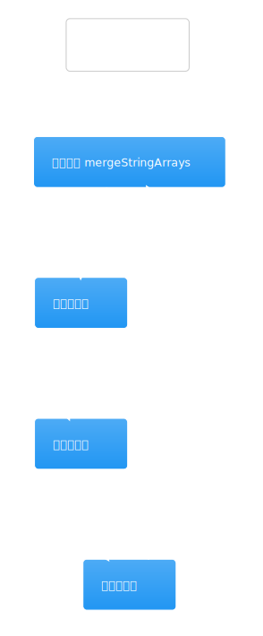
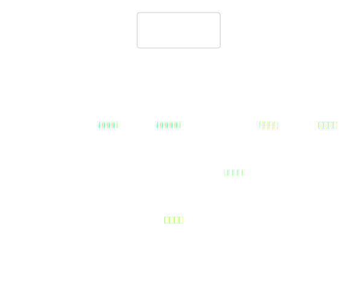
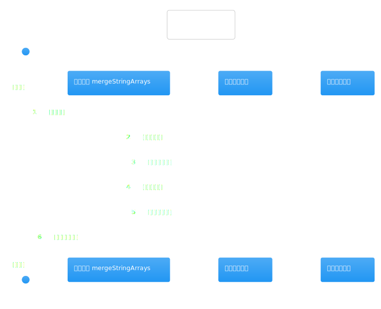
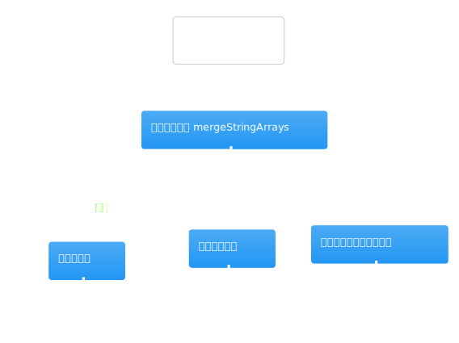
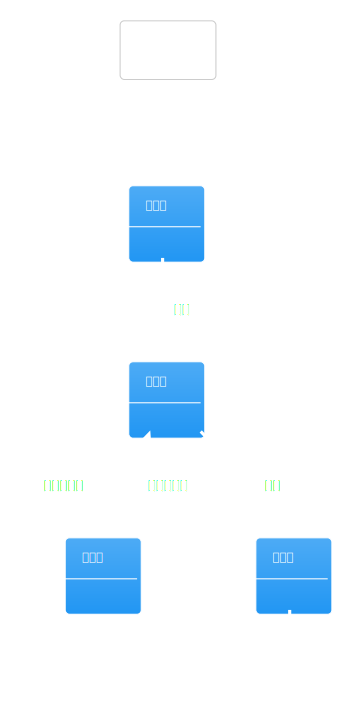
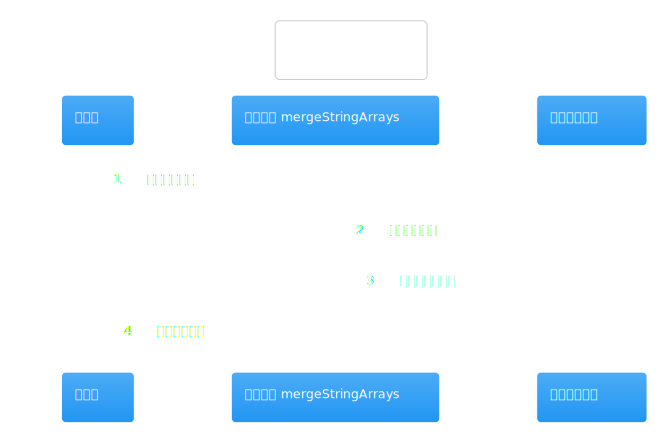
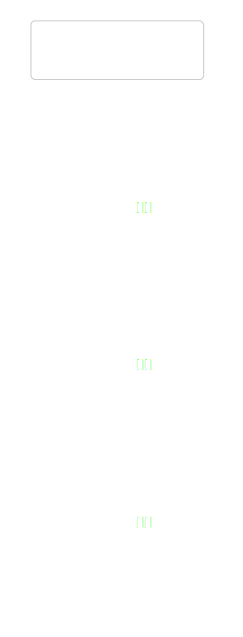

# 热点洞察：company-research-graph.ts

- 源文件: `src/server/infrastructure/workflow/langgraph/company-research-graph.ts`
- 热点分数: `77`
- 为什么难: 一个文件里同时堆了 V1/V2/V3/V4 四代图，还把 pause/resume、节点输出映射和 fan-out/join 都写在了一起。
- 建议先看节点: `CompanyResearchContractLangGraph`、`agent0_clarify_scope`、`agent2_plan_research_units`、`collector_industry_sources`、`agent5_gap_analysis_and_replan`

这页建议你只盯 V4，也就是 `CompanyResearchContractLangGraph`。把它理解成“公司研究 run 的路由表”就够了: 图层决定走哪条线，真正干活的是 `CompanyResearchWorkflowService`。

## 先带着这 4 个问题看图

1. 为什么 resume 到 collector 时，会被重定向回 `agent3_source_grounding`？
2. 四个 collector 节点是怎样 fan-out 并在 `agent4_synthesis` join 的？
3. `gap loop` 在首轮采集之后插在哪个位置？
4. 哪一步会主动抛 `WorkflowPauseError` 暂停整个 run？

## 架构图组

### 架构总览图

图前说明：上游是 execution service 和 graph registry 选择图版本，下游是 `CompanyResearchWorkflowService` 负责具体节点的业务执行。

图后解读：这张图最重要的结论是，LangGraph 层负责“路由和阶段切换”，并不负责抓网页、规划问题或打分证据。

### 模块拆解图

图前说明：读这个文件时，先把它拆成四块: 多代图定义、resume 逻辑、V4 节点执行器、节点输出映射。

图后解读：如果你一开始就从文件顶端线性往下读，很容易被历史版本带偏。最省时间的方法是直接跳到 `CompanyResearchContractLangGraph` 附近。

### 依赖职责图

图前说明：这里真正重要的依赖并不多，核心就是 `workflowService` 和 `StateGraph` builder。

图后解读：如果某个节点的业务含义不清楚，别在图文件里硬想，直接跳去对应的 workflow service 方法。

## 主流程活动图

### 主流程活动图

图前说明：这张图建议对照 `1045` 行附近的 V4 定义一起看，顺着节点名把一条主线先串起来。

图后解读：V4 主线可以简化成五段: 澄清范围、写 brief、计划研究单元、四路采集并 join、补洞后定稿。记住这五段，再回源码就不会被节点名淹没。

## 协作顺序图

### 协作顺序图

图前说明：顺序图最值得看的是“图层如何把 state 交给 workflow service，再把返回的部分状态 merge 回图状态”。

图后解读：如果你在排查“某个节点明明执行了，为什么结果没进 state”，先回这张图看对应节点返回了哪些字段。

## 分支判定图

### 分支判定图

图前说明：这页的关键分支只有少数几个，但都非常关键: 需要澄清时暂停、某个 capability 没有对应 unit 时跳过 collector、resume 到 collector 时回退到 `agent3_source_grounding`。

图后解读：对照这张图，你可以很快判断某次 run 是“正常跳过某节点”还是“因为缺少 state 被异常绕开”。

## 状态图

### 状态图

图前说明：这里的“状态”更像节点阶段，而不是传统业务状态枚举。

图后解读：如果你把它理解成“研究 run 从哪一段流到下一段”，这张图会非常有用；如果把它理解成数据库状态表，反而会更乱。

## 异步/并发图

### 异步/并发图

图前说明：V4 最重要的并发不是线程，而是四个 collector 节点的显式 fan-out / join。

图后解读：这张图最能解释为什么 `industry_search` 这类能力不是一个隐式工具调用，而是图上单独的一条分支。

## 数据/依赖流图

### 数据/依赖流图

图前说明：顺着 `researchInput -> taskContract / brief -> researchUnits -> evidence / references -> finalReport` 这条线看图，会比盯节点名更轻松。

图后解读：如果你在追某个字段到底从哪来，这张图是最好的入口，尤其适合排查 `researchUnits`、`collectorRunInfo` 和 `finalReport`。
