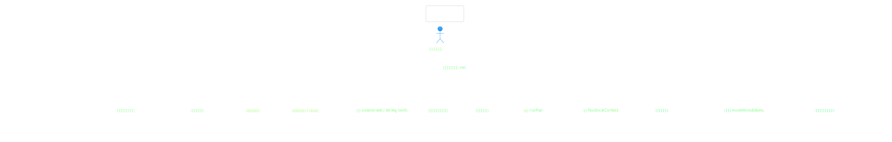
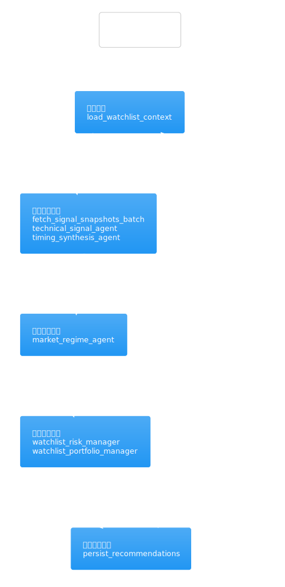
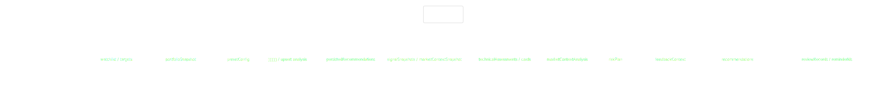
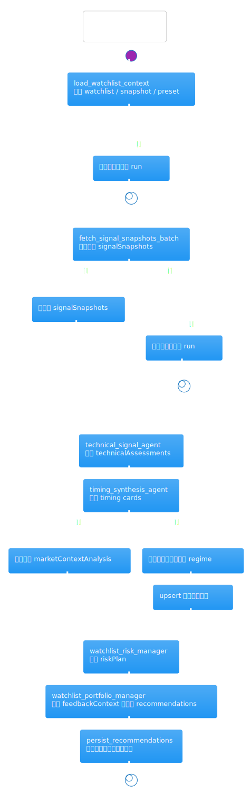
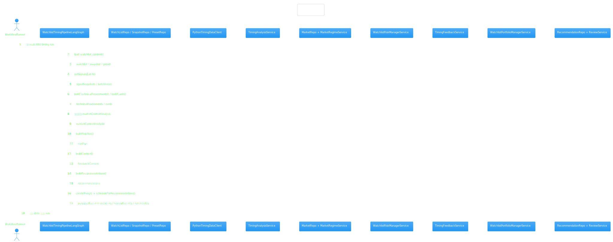
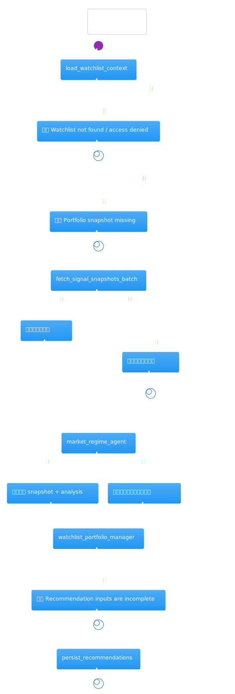
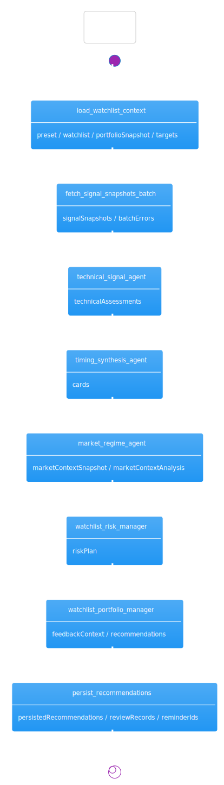
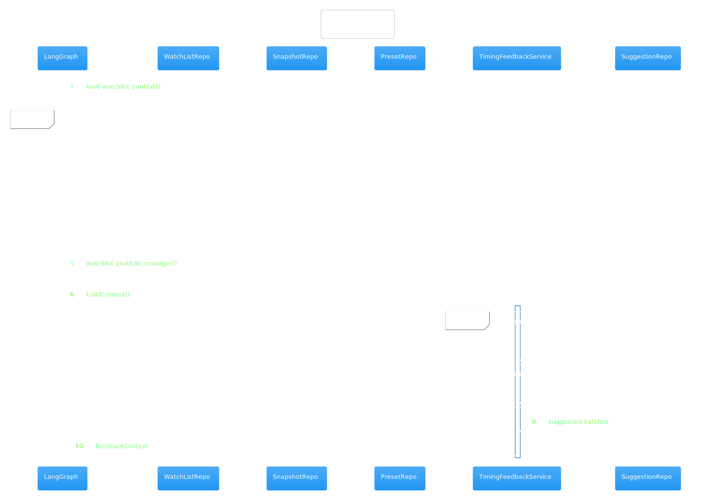
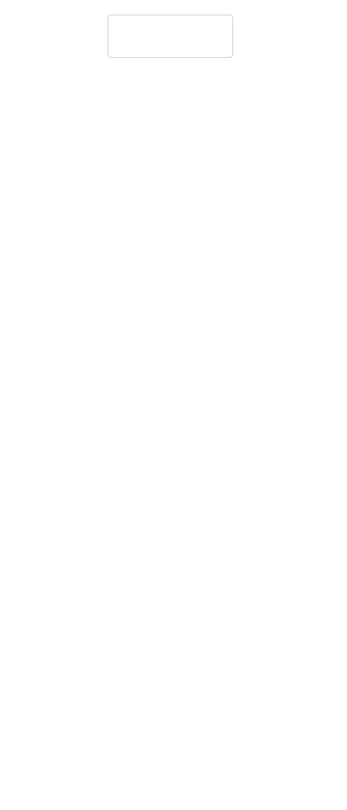

# 热点洞察：watchlist-timing-graph.ts

- 源文件: `src/server/infrastructure/workflow/langgraph/watchlist-timing-graph.ts`
- 实际阅读入口: `WatchlistTimingPipelineLangGraph`
- 推荐阅读顺序: [`workflow-command-service`](../workflow-command-service/workflow-command-service.md) -> 当前页 -> [`watchlist-risk-manager-service`](../timing/watchlist-risk-manager-service.md) -> [`watchlist-portfolio-manager-service`](../timing/watchlist-portfolio-manager-service.md) -> [`timing-feedback-service`](../timing/timing-feedback-service.md)
- 这页重点: 搞清楚“自选股 + 组合快照 + 预设”是如何被 LangGraph 串成一次完整的组合建议运行

这个文件是“择时组合”后端的总装配点。真正难的地方不在某个单独节点，而在于同一个 `WorkflowState` 同时承载输入、批量信号、技术判断、市场语境、风险预算、反馈上下文、最终建议和复盘提醒，读源码时很容易在状态字段和节点切换之间迷路。

## 架构图组

先把它当成一条固定节点顺序的流水线来看。当前页的作用不是解释每个指标怎么算，而是建立一张“哪个节点负责什么、什么时候把什么写回 state”的地图。

### 架构总览图

图前说明：这张图回答“谁触发这条图、图里依赖了哪些服务、最终把什么产物写回去”。

图后解读：先记住这条主线即可。`load_watchlist_context` 准备输入，`fetch_signal_snapshots_batch` 和 `market_regime_agent` 拉外部数据，`watchlist_risk_manager` 与 `watchlist_portfolio_manager` 负责把“单股判断”升级成“组合动作”，最后 `persist_recommendations` 同时落库建议和复盘任务。

### 模块拆解图

图前说明：不要把这个文件看成 8 个平铺的节点，更适合按“上下文准备 / 信号生成 / 组合约束 / 结果落库”四段理解。

图后解读：这里最值得保护的边界有两个。第一，`TimingAnalysisService` 只负责把行情快照解释成技术 assessment 与卡片；第二，风险预算和组合建议分别落在 `WatchlistRiskManagerService` 与 `WatchlistPortfolioManagerService`，不要把组合规则重新塞回 graph 节点里。

### 依赖职责图

图前说明：这张图重点看每类依赖在流水线里扮演什么角色，而不是简单记住依赖名。

图后解读：依赖可以分成四类。仓储负责上下文与持久化，`PythonTimingDataClient` 负责行情与市场快照，应用服务负责解释与决策，`TimingReviewSchedulingService` 负责把一次建议延长成后续复盘闭环。

## 主流程活动图

### 主流程活动图

图前说明：沿着节点顺序读，不要跳着看。`WATCHLIST_TIMING_PIPELINE_NODE_KEYS` 已经把“组合建议运行”的骨架写死了。

图后解读：这条主路径可以简化成 5 步。
1. 载入 `watchlist`、`portfolioSnapshot`、`preset`。
2. 拉取批量信号并生成技术 assessment / timing cards。
3. 生成或复用市场语境。
4. 基于市场语境先做 `riskPlan`，再做 `recommendations`。
5. 持久化建议，并为每条建议安排复盘记录与提醒。

## 协作顺序图

### 协作顺序图

图前说明：这张图适合回答“一个 graph 节点到底只是搬运数据，还是会触发真实外部协作”。

图后解读：时序上最重要的事实有两个。第一，`load_watchlist_context` 自带 `Promise.all`，会并发取自选股、组合快照和预设；第二，`watchlist_portfolio_manager` 自己并不查询反馈建议，而是先调用 `TimingFeedbackService.buildContext()` 拿到反馈摘要，再把它注入组合建议结果。

## 分支判定图

### 分支判定图

图前说明：这张图聚焦几个真正会改变执行路径的守卫条件。

图后解读：最关键的分支不是买卖规则，而是上下文完整性与缓存命中。`watchList` / `portfolioSnapshot` 缺失会立即失败；市场语境如果命中仓储缓存会跳过远端获取与分析；组合建议阶段若缺少 `riskPlan` 等前置结果也会直接中断。

## 状态图

### 状态图

图前说明：这里的“状态”更适合理解成 Graph state 在不同阶段逐步变丰满，而不是传统的业务状态机。

图后解读：如果你在源码里迷路，可以盯住 4 个 state 片段看：`timingInput`、`cards`、`marketContextAnalysis/riskPlan`、`recommendations/persistedRecommendations`。这 4 组字段基本对应了整条流水线的四次语义升级。

## 异步/并发图

### 异步/并发图

图前说明：这张图专门看 graph 内部的并发读和串行决策是怎么搭配的。

图后解读：这条链路并不是“全异步并发”。真正并发的部分集中在上下文拉取和 `buildContext()` 的内部仓储查询；真正必须串行的是“卡片 -> 市场语境 -> 风险预算 -> 组合建议 -> 持久化”这条主决策线。

## 数据/依赖流图

### 数据/依赖流图

图前说明：如果你想知道某个字段是在哪里第一次出现的，这张图最有用。

图后解读：数据是一路被“提纯”的。原始输入先变成 `targets`，再变成 `signalSnapshots`，再变成 `cards`，随后叠加 `marketContextAnalysis`、`riskPlan` 与 `feedbackContext`，最后生成 `recommendations` 并落成 `persistedRecommendations`、`reviewRecords`、`scheduledReminderIds`。

结尾总结：如果只想建立最快的心智模型，先记住这句即可: `watchlist-timing-graph` 不是在“算买卖点”，而是在“编排多个 timing service，把单股判断升级成带风险预算和复盘闭环的组合建议运行”。
