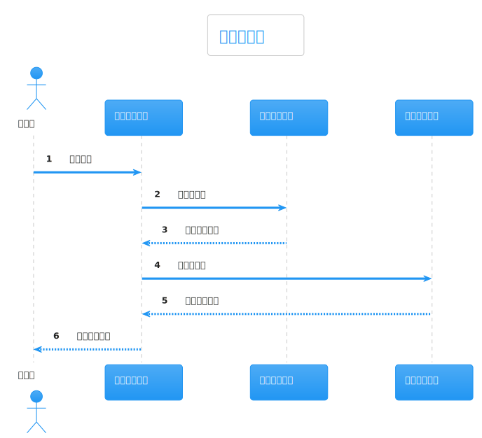
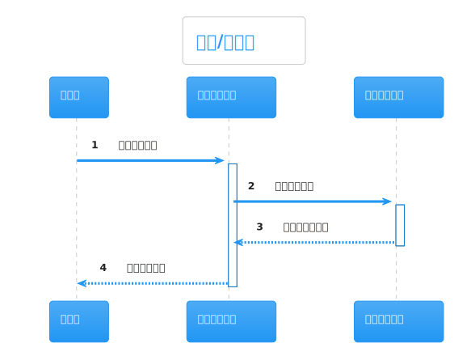

# 热点洞察: company-research-agent-service.ts

- 源文件: `src/server/application/intelligence/company-research-agent-service.ts`
- 热点分数: `82`
- 主入口: `groundSources()`、`curateEvidence()`、`enrichReferences()`、`answerQuestions()`、`buildVerdict()`
- 为什么难: 新版仍在使用的整理逻辑和旧版直接采集逻辑混在同一个大文件里

这是当前最容易让人误判主路径的文件。它既包含 V1/V2 直接采集器，也包含 V3/V4 仍然依赖的证据整理和最终总结逻辑。

## 这页怎么读

- 如果你读的是 V4 主路径，第一次可以把 `collectOfficialSources()`、`collectNewsSources()`、`collectIndustrySources()` 放到第二优先级。
- 先看 `groundSources()`、`mapConceptInsights()`、`designDeepQuestions()`、`curateEvidence()`、`enrichReferences()`、`answerQuestions()`。
- 当你需要理解 V2 或 legacy graph 时，再回头看各个 `collect*Sources()`。

## 架构图组

### 架构总览图

这张图用来区分“它现在还负责什么，不再负责什么”。

图后解读: 在新主路径里，它更像“研究代理与整理器”；在旧路径里，它又兼任“直接采集器”。把这两种身份分开，你会一下子轻松很多。

### 模块拆解图

先把内部职责拆成几块。

图后解读: 这个文件大致可拆成五块:
brief/问题生成，
source grounding，
legacy collectors，
evidence curation + reference enrichment，
question answering + verdict + confidence。

### 依赖职责图

这张图最适合看它如何同时连接模型、网页抓取和 Python 数据服务。

图后解读: `DeepSeekClient` 负责概念、问题、回答和 verdict；`FirecrawlClient` 负责网页抓取与补全引用；`PythonIntelligenceDataClient` 负责金融包；`ConfidenceAnalysisService` 负责最终置信度分析。

## 主流程活动图

这张图建议先把“仍在使用的整理主线”看清楚。

图后解读: 对新主路径最关键的主线是:
先用 `groundSources()` 给出起始可信源，
再用 `curateEvidence()` 选出高质量证据，
然后 `enrichReferences()` 补强引用，
最后 `answerQuestions()`、`buildVerdict()`、`analyzeConfidence()` 收束成结果。

## 协作顺序图

这张图更适合看整理阶段而不是采集阶段。

图后解读: 新路径里，这个 service 更像“后处理和综合器”。它接收执行层给出的 evidence/reference，再通过模型把证据映射成问题答案和投资结论。

## 分支判定图

这张图主要解释为什么 `enrichReferences()` 和证据打分逻辑显得很密。

图后解读: 最重要的判断点有三个:
引用是否值得增强，
来源是否属于 first-party，
某条证据对当前问题是否足够相关。

## 异步/并发图

并发主要集中在引用增强和旧版采集器。

图后解读: `enrichReferences()` 会并发抓取一批引用页面；旧版 `collectEvidence()` 也会并发调多个 collector。所以这个文件看起来既像代理又像调度器，实际上是历史演进留下的痕迹。

## 数据/依赖流图

这张图最适合看“证据如何变成可引用结论”。

图后解读: `curateEvidence()` 会把不同 collector 的证据打分、去重、裁剪成精选 evidence，再生成 `references`。`answerQuestions()` 又会按问题重新挑选局部最相关证据，最后交给 verdict 和 confidence。

## 结论

读这个文件时记住两句就够了:

- V4 主路径主要用它做“整理、总结、评估”，不是做“真正的行业网页采集”。
- V1/V2 旧路径才会直接大量使用它的 `collect*Sources()` 和 `collectEvidence()`。
