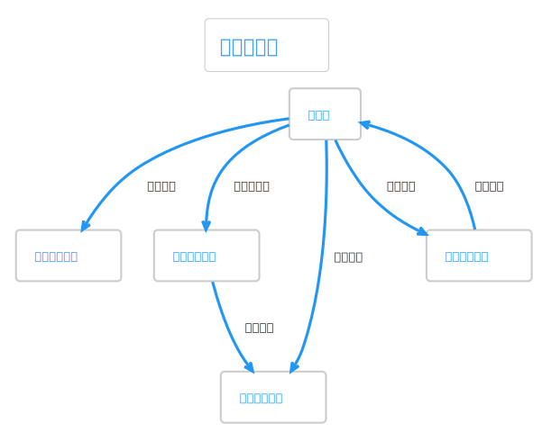
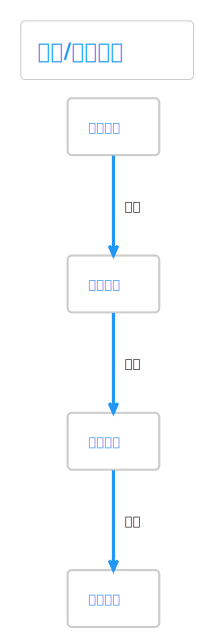

# 热点洞察: company-research-workflow-service.ts

- 源文件: `src/server/application/intelligence/company-research-workflow-service.ts`
- 热点分数: `85`
- 主入口: `planUnits()`、`executeUnits()`、`runGapLoop()`、`finalizeReport()`
- 为什么难: 一个类同时承担计划前准备、研究单元执行、补洞循环和最终报告编排

这是行业研究新主路径里最值得精读的文件。可以把它理解成“V3/V4 公司研究的执行核心”，图层把节点串好以后，真正的工作大多落在这里。

## 这页怎么读

- 第一次阅读优先看 `planUnits()`、`runCollectorUnit()`、`executeUnits()`、`runGapLoop()`。
- 如果你只追行业研究，不要先陷进 `finalizeReport()`；先把证据是怎么被采集出来的弄清楚。
- 源码锚点:
  `358-390` 负责研究单元规划前准备，
  `393-650` 负责单个 collector unit 的执行，
  `709-795` 负责批次调度，
  `798-924` 负责 gap loop。

## 架构图组

### 架构总览图

这张图回答“它在新工作流里夹在图层和代理层之间做什么”。

图后解读: 上游是 LangGraph 节点，下游一边连 `ResearchToolRegistry` 做外部工具调用，一边连 `CompanyResearchAgentService` 做概念拆解、证据整理和最终结论。

### 模块拆解图

先用这张图把类里的四块职责拆开。

图后解读: 读这个文件时最容易混淆的是“准备阶段”和“执行阶段”。比较稳的拆法是:
输入澄清/brief 生成，
研究单元规划，
研究单元执行，
补洞与最终收束。

### 依赖职责图

这张图用来定位职责边界。

图后解读: `ResearchToolRegistry` 只负责拿数据，`CompanyResearchAgentService` 只负责把数据变成高质量研究输出，这个 service 自己负责把两边编排起来。

## 主流程活动图

这是理解 V3/V4 主链的最佳入口。

图后解读: 主链不是“搜完就结束”，而是 `plan -> execute -> curate -> gap -> compress -> finalize`。`runGapLoop()` 的存在说明第一次采集默认不是终点，而是一个可回补的迭代点。

## 状态图

这张图重点看 `workingState` 是怎么被逐步扩充的。

图后解读: 真正的状态推进主要发生在 `executeUnits()` 和 `runGapLoop()`。前者堆积 `collectedEvidenceByCollector`、`researchNotes`、`researchUnitRuns`，后者再把 `gapAnalysis`、`replanRecords`、追加 unit 写回。

## 异步/并发图

行业研究的并发控制几乎都在这里。

图后解读: `executeUnits()` 不是简单 `Promise.all`。它会先根据 `dependsOn` 找出 ready units，再用 `maxConcurrentResearchUnits` 切 batch。V3 的并发执行就是在这里完成的。

## 协作顺序图

这张图适合看 `industry_search` 真实穿过了哪些对象。

图后解读: 当 unit capability 为 `industry_search` 时，`runCollectorUnit()` 会把它映射成 `collectorKey = industry_sources`，生成行业查询词，再交给 `ResearchToolRegistry.searchWeb()`，而不是直接走旧版 `collectIndustrySources()`。

## 分支判定图

这张图最适合用来理解 `runCollectorUnit()` 为什么看起来很密。

图后解读: 这里至少有三层分支:
按 capability 选择 `financial_pack` 或 web collector，
按 collectorKey 区分 official/news/industry，
按是否拿到证据决定 quality flags 和 notes。

## 数据/依赖流图

这张图专门看证据是怎么变成最终报告输入的。

图后解读: 原始搜索结果先变成 `CompanyEvidenceNote`，再经过 `curateEvidence()` 变成精选 `evidence + references`，最后进入 `answerQuestions()`、`buildVerdict()` 和 `analyzeConfidence()`。

## 结论

如果你记不住整个文件，只记这四个结论就够了:

- `planUnits()` 决定要搜什么。
- `executeUnits()` 决定按什么顺序、并发度去搜。
- `runGapLoop()` 决定第一次结果够不够。
- `finalizeReport()` 决定怎么把证据收束成研究结论。
