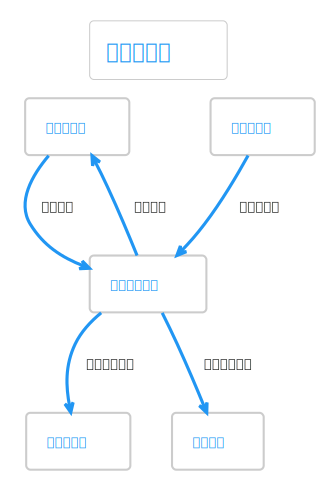
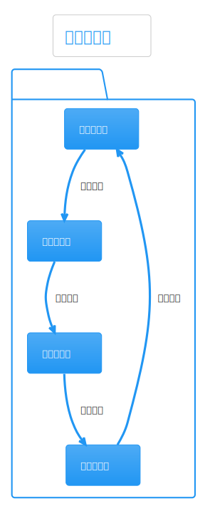

# 热点洞察: research-workflow-kernel.ts

- 源文件: `src/server/application/intelligence/research-workflow-kernel.ts`
- 热点分数: `65`
- 主入口: `writeTaskContract()`、`writeResearchBrief()`、`planResearchUnits()`、`analyzeResearchGaps()`
- 为什么难: 它不直接做 I/O，却定义了工作流的默认策略、角色、单元、补洞和降级规则

这个文件是行业研究工作流的“策略内核”。很多看似来自 LLM 的行为，其实先在这里就已经有默认值和 fallback 了。

## 这页怎么读

- 先看 `acceptanceCriteriaFor()`、`buildTaskContractFallback()`、`buildUnitPlanFallback()`。
- 再看导出的四个函数: `writeTaskContract()`、`writeResearchBrief()`、`planResearchUnits()`、`analyzeResearchGaps()`。
- 如果你只关心行业研究 capability，重点看 `industry_search` 在哪些表里被映射:
  角色、产物、fallback capability、acceptance criteria、默认单元。

## 架构图组

### 架构总览图

这张图回答“为什么一个看起来像工具函数集合的文件会影响整个流程行为”。

图后解读: 这个 kernel 不负责拿证据，只负责把“研究请求”变成“可执行合同与单元”。因此它是图层和执行层之间最重要的规则源。

### 模块拆解图

先用这张图把内部模块拆开。

图后解读: 可以把它拆成四组:
capability 元数据，
fallback builders，
LLM contract writers，
gap/compression helpers。

### 依赖职责图

这张图帮助判断哪些逻辑是“硬规则”，哪些逻辑是“模型可变输出”。

图后解读: 真正给模型的输入已经被 kernel 预先框住了。模型不是从零自由发挥，而是在 `schema + fallback + budgetPolicy` 的约束下生成结构化结果。

## 主流程活动图

这张图最适合理解请求是如何逐层收束的。

图后解读: 研究请求先被收束成 task contract，再收束成 brief，再收束成 research units，之后还能被 gap analysis 重新追加 follow-up units。这个收束顺序是行业研究单元化的核心。

## 协作顺序图

这张图适合看它和 `DeepSeekClient` 的协作关系。

图后解读: kernel 的写法很有代表性:
先构造 fallback，
再构造 schema，
最后调用 `completeContract()`。
所以排查结果异常时，先看 fallback，再看 prompt，不要反过来。

## 分支判定图

这张图重点看 capability 相关决策。

图后解读: `industry_search` 在这里的定义很完整:
角色是 `industry_collector`，
产物是 `industry_evidence_bundle`，
默认 fallback 是 `news_search` 和 `official_search`，
验收标准是“映射竞争格局或产业链位置，并返回能回答战略问题的证据”。

## 异步/并发图

虽然这个文件本身不做采集，但它决定了后续并发能不能成立。

图后解读: `planResearchUnits()` 输出的 `dependsOn`、`priority`、`capability`，是执行层能否安全并发的重要前提。并发行为在 service 层，约束规则在 kernel 层。

## 数据/依赖流图

这张图适合看结构化数据的演化。

图后解读: 从 `ResearchPreferenceInput` 到 `ResearchTaskContract`，再到 `ResearchBriefV2`、`ResearchUnitPlan[]`、`ResearchGapAnalysis`，这条链路就是工作流的“规范化过程”。

## 结论

如果你在行业研究里看到某个行为很“自动”，优先来这个文件查三件事:

- 默认合同要求了什么源和什么章节。
- 默认单元里有没有 `industry_search`。
- 当证据不足时，gap fallback 会追加什么 follow-up unit。
