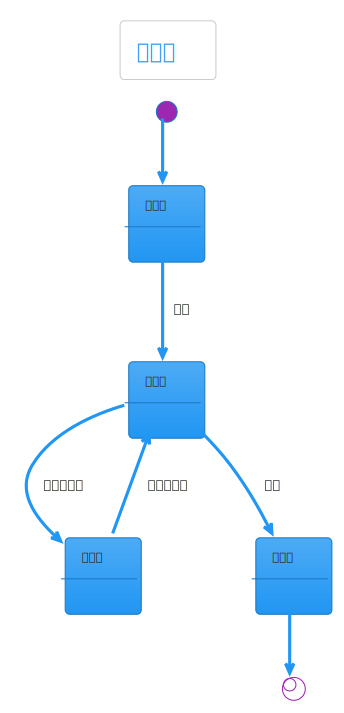
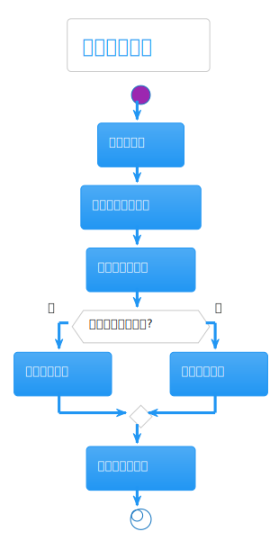
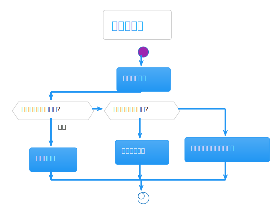

# 热点洞察: company-research-graph.ts

- 源文件: `src/server/infrastructure/workflow/langgraph/company-research-graph.ts`
- 热点分数: `77`
- 推荐阅读入口: `CompanyResearchContractLangGraph` 和 `ODRCompanyResearchLangGraph`
- 为什么难: 一个文件里同时维护了 V1、V2、V3、V4 四代公司研究图

这页的目标不是让你逐行读完这个文件，而是先把四代图的边界分清楚。第一次阅读时，优先关注 V4，其次看 V3；只有在排查兼容行为时再回头看 V1/V2。

## 这页怎么读

- 先看“状态图”和“主流程活动图”，确认四代图之间的结构差异。
- 再看“异步/并发图”和“协作顺序图”，理解 V2/V4 的 fan-out 是怎么挂上的。
- 最后回源码定位三段关键区域:
  `496-668` 是 V2，`786-910` 是 V3，`1045-1302` 是 V4。

## 架构图组

### 架构总览图

这张图用来回答“公司研究图在整个工作流体系里处于什么位置”。

图后解读: 这个文件不是业务计算层，而是 LangGraph 基础设施层里的“流程装配厂”。真正的研究逻辑主要下沉到 `CompanyResearchAgentService` 或 `CompanyResearchWorkflowService`。

### 模块拆解图

这张图用来回答“为什么一个文件会显得像好几个系统叠在一起”。

图后解读: 难点在于它不是单一 graph，而是四个版本共存。读图时把它拆成三部分看最清楚:
`LegacyCompanyResearchLangGraph`/`CompanyResearchLangGraph` 属于旧路径，`ODRCompanyResearchLangGraph`/`CompanyResearchContractLangGraph` 属于单元化新路径。

### 依赖职责图

这张图用来回答“每一代图分别把业务委托给谁”。

图后解读: V1/V2 主要委托给 `CompanyResearchAgentService`，V3/V4 主要委托给 `CompanyResearchWorkflowService`。这就是为什么同样叫“collector_industry_sources”，背后的执行方式并不一样。

## 状态图

先看这张图，比先看源码更容易建立版本感。

图后解读: 这个文件里最重要的“状态”不是领域状态，而是“当前跑的是哪一代图、卡在哪个节点、能否恢复”。`getResumeNodeKey()` 的复杂度高，正是因为它要兼容这些版本差异。

## 主流程活动图

这张图用于抓住 V4 的默认读法。

图后解读: V4 的主线是 `clarify -> brief -> plan -> source_grounding -> fan-out collectors -> synthesis -> gap loop -> compress -> enrich -> finalize -> reflection`，源码在 `1269-1302`。

## 异步/并发图

行业研究最容易绕晕的地方在这里。

图后解读: V2 和 V4 都是显式 collector fan-out，但 V4 的每个 collector 节点又进一步委托给 `executeCollectorUnit()`；V3 则没有显式 fan-out，而是在 `agent3_execute_research_units` 内部做批次并发。

## 协作顺序图

这张图适合拿来区分“图负责什么，服务负责什么”。

图后解读: 图层只负责节点顺序、恢复点和状态合并。真正的研究计划、证据采集和报告生成都发生在服务层。看到复杂图时，不要在这里找“行业搜索 query 是怎么拼的”，那是服务层职责。

## 分支判定图

这张图专门看恢复和条件跳转。

图后解读: 最重要的分支有两个:
一是 `clarifyScope()` 可能抛 `WorkflowPauseError` 暂停流程；
二是恢复执行时，collector 节点会被重映射回更早的 source-grounding 节点。

## 数据/依赖流图

这张图适合配合 `CompanyResearchGraphState` 一起看。

图后解读: 如果你想追行业研究数据如何流动，优先盯住这些字段:
`researchUnits`、`collectedEvidenceByCollector`、`collectorRunInfo`、`gapAnalysis`、`finalReport`。

## 结论

这个文件最值得记住的不是某个具体函数，而是三条版本规律:

- V1 是“整包采集”。
- V2 是“显式 collector，但仍由 agent service 直接执行”。
- V3/V4 是“研究单元化”，其中 V4 又把 collector 显式拉回图上以增强可观察性。
