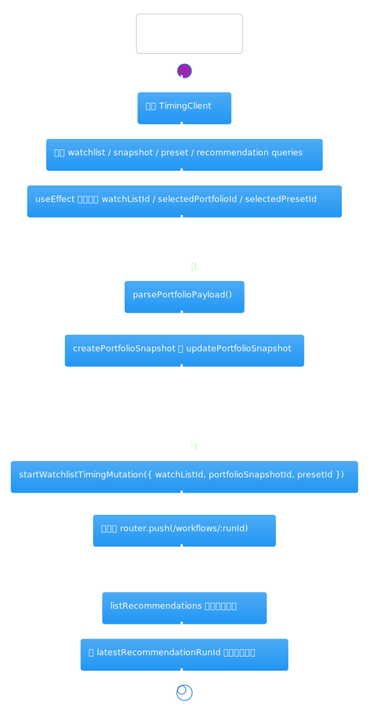
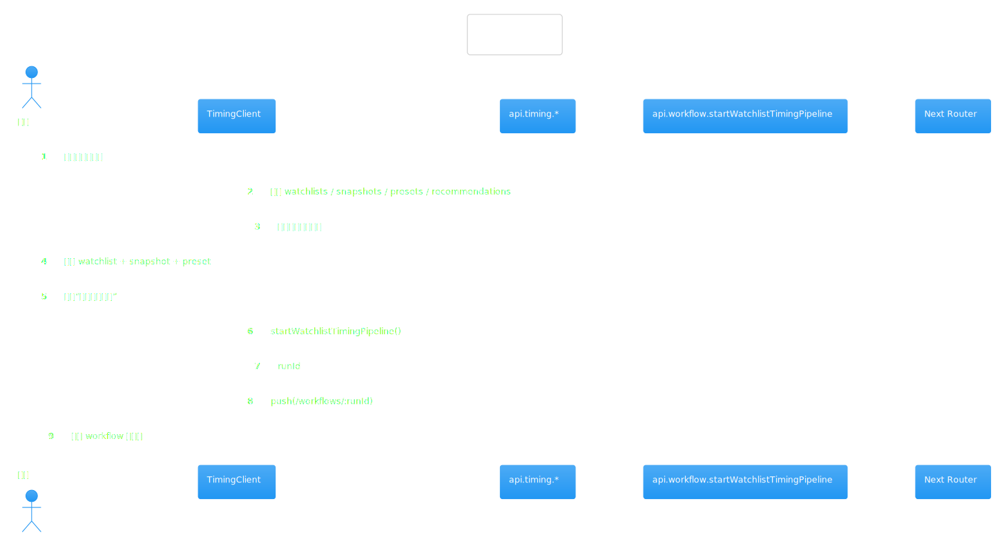
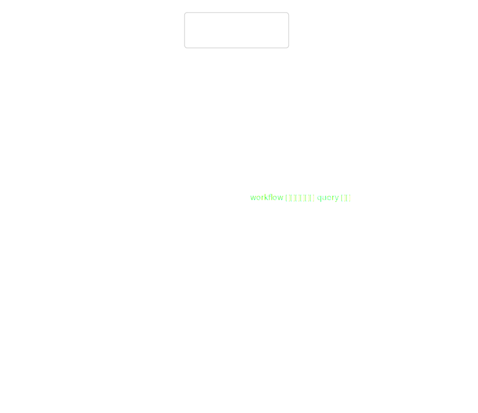

# 热点洞察：timing-client.tsx

- 源文件: `src/app/timing/timing-client.tsx`
- 实际阅读入口: `TimingClient`
- 推荐阅读顺序: 当前页 -> [`workflow-command-service`](../workflow-command-service/workflow-command-service.md) -> [`watchlist-timing-graph`](../langgraph-watchlist-timing-graph/analysis.md)
- 这页重点: 搞清楚前端工作台如何收集上下文、触发 workflow，并把最新一次组合建议重新组织成可读界面

这个组件难读，不是因为单个 JSX 块特别复杂，而是因为一个文件同时承担了 4 类职责：查询 watchlist / snapshot / preset / recommendation 数据，本地维护多个表单状态，触发多种 workflow mutation，以及把“最新一次 run”的建议结果重新切成多个面板展示。

## 架构图组

### 架构总览图

图前说明：先把它看成“择时组合工作台壳层”，而不是“组合建议计算器”。

图后解读：这个组件本身不做组合建议推理。它真正做的是收集 `watchListId + selectedPortfolioId + selectedPresetId` 这三个关键上下文，然后通过 `api.workflow.startWatchlistTimingPipeline` 把请求交给后端工作流系统。

### 模块拆解图

图前说明：按 UI 语义拆开比按代码块拆开更容易读懂。

图后解读：可以把页面拆成 5 块来读：顶部最新建议摘要、风险预算语境、单股/批量信号触发、组合快照与 preset 维护、建议明细与复盘记录。这样能避免在一个超长组件里来回迷失。

### 依赖职责图

图前说明：这张图重点看 queries、mutations、router push 各自做什么。

图后解读：`api.timing.*` 查询的是工作台上下文与结果，`api.workflow.*` mutation 负责启动新的 run，`router.push()` 则把用户带到具体的 workflow 运行页。页面本身更像 orchestration shell。

## 主流程活动图

### 主流程活动图

图前说明：把用户最常见的“生成组合建议”路径单独拉出来看。

图后解读：最常见的路径是：页面初始化拉 query -> `useEffect` 自动补齐默认 watchlist / snapshot / preset -> 用户维护组合快照或 preset -> 点击“生成组合建议” -> 调 `startWatchlistTimingMutation` -> 成功后跳转到 `/workflows/:runId`。等 workflow 跑完，页面再通过 `listRecommendations` 把结果拿回来。

## 协作顺序图

### 协作顺序图

图前说明：这张图适合用来看“前端操作”和“后端 workflow”是如何接上的。

图后解读：时序上最重要的是 mutation 成功并不直接返回建议内容，而是只返回 `runId`。这意味着页面展示的建议结果和启动动作并不是同一次请求的返回值，而是后续由查询接口重新拉回来的持久化结果。

## 分支判定图

### 分支判定图

图前说明：这张图只看几个影响用户能否触发动作的守卫条件。

图后解读：最重要的分支有三个：`parsePortfolioPayload()` 的 JSON 解析失败会阻断快照保存；没有 `watchListId / selectedPortfolioId` 时不能启动组合建议；没有 `selectedPresetId` 虽然仍可运行，但 workflow 会以默认 preset 配置推进。

## 异步/并发图

### 异步/并发图

图前说明：这个文件的异步复杂度主要来自“很多 query/mutation 同时存在”，不是复杂并发算法。

图后解读：要读顺这个组件，先把异步操作按目的分类：页面装载 query、保存配置 mutation、启动 workflow mutation、刷新结果 invalidate/refetch。这样比按代码出现顺序硬读更容易形成稳定心智模型。

## 数据/依赖流图

### 数据/依赖流图

图前说明：最值得追的数据不是单个 input，而是“最新建议”的整理过程。

图后解读：页面会先拿到全部 `recommendations`，再按 `latestRecommendationRunId` 截出最近一次运行的结果，随后派生出 `latestRecommendations`、`recommendationContext` 等展示数据。也就是说，页面展示的是“最近一次 run 的视图模型”，而不是简单把接口原样渲染出来。

结尾总结：把 `TimingClient` 看成“组合建议工作台壳层”最容易懂。它的职责是收集上下文、触发 run、重组结果；真正的组合推理与预算决策发生在后端 workflow graph 和 timing services 里。
