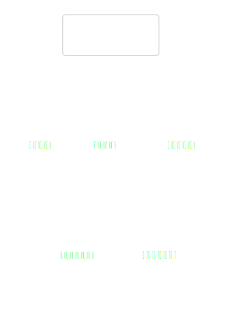
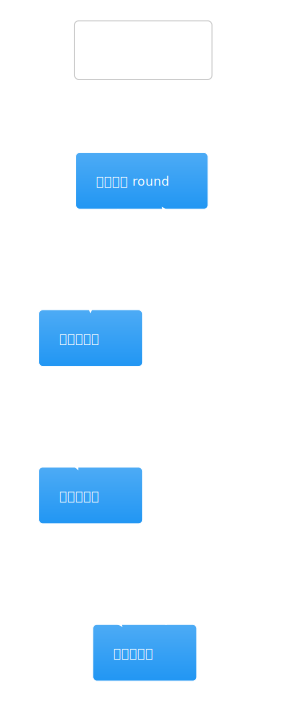
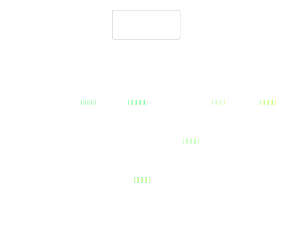
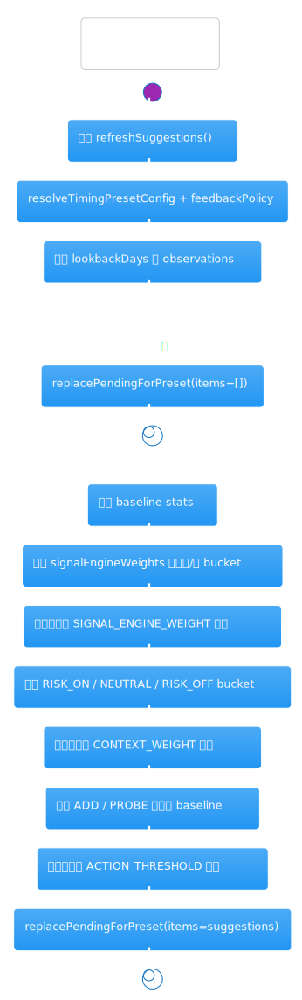
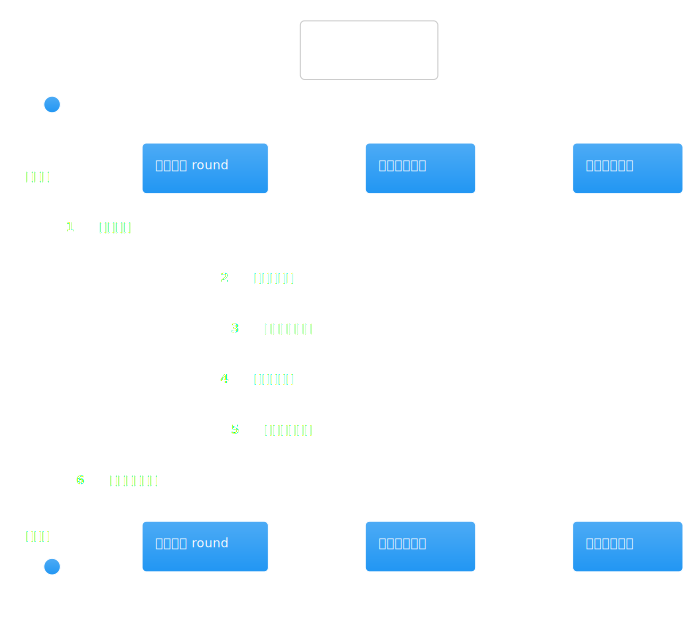
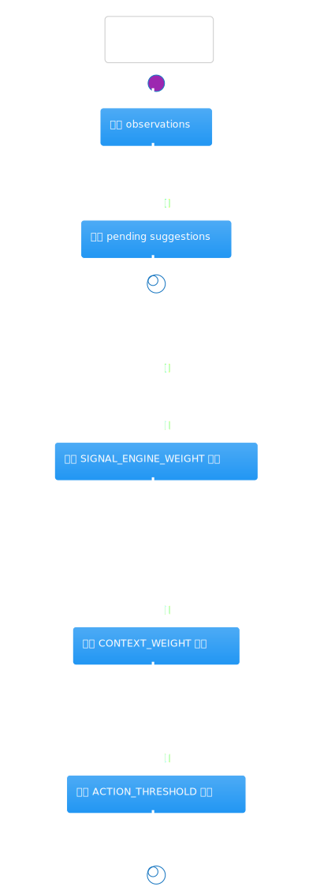
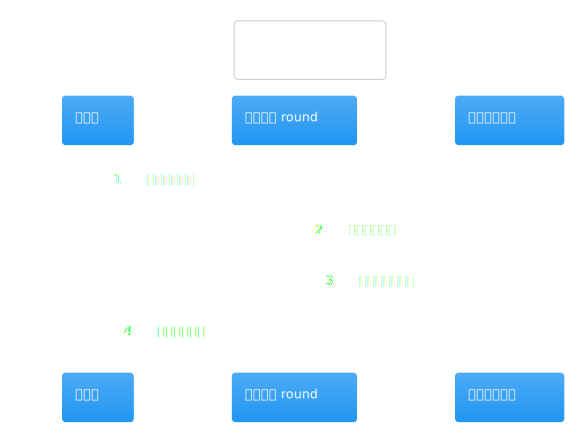
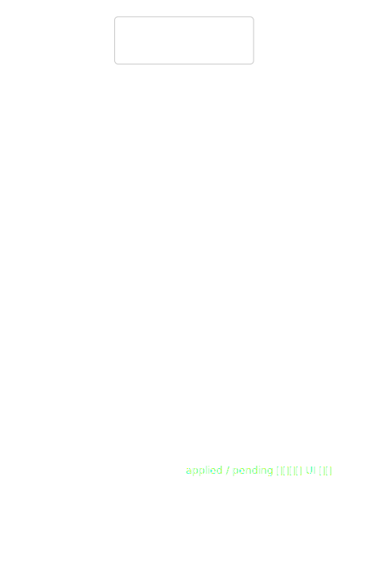

# 热点洞察：timing-feedback-service.ts

- 源文件: `src/server/application/timing/timing-feedback-service.ts`
- 实际阅读入口: `buildContext()` 与 `refreshSuggestions()`
- 推荐配套阅读: [`watchlist-timing-graph`](../langgraph-watchlist-timing-graph/analysis.md) / [`watchlist-portfolio-manager-service`](./watchlist-portfolio-manager-service.md)
- 这页重点: 搞清楚反馈层怎样把历史复盘样本重新转成 preset 调整建议

这个文件和组合建议不是同一层职责。graph 在生成组合建议时只调用 `buildContext()`，把“最近采纳过哪些反馈、还有多少待处理建议”注入说明文字；真正复杂的学习逻辑集中在 `refreshSuggestions()`，它由复盘流水线调用，用历史 observation 重新生成 `signalEngineWeights / contextWeights / actionThresholds` 的调整建议。

## 架构图组

### 架构总览图

图前说明：这张图回答“谁来调用反馈服务，以及它最终写回什么类型的产物”。

图后解读：输入源主要有两类。`observationRepository` 提供复盘样本，`suggestionRepository` 负责读取或替换调整建议。输出则分成两条：轻量的 `TimingFeedbackContext` 给组合建议页展示，重量级的 `TimingPresetAdjustmentSuggestionDraft[]` 给后续人工采纳。

### 模块拆解图

图前说明：内部可以拆成“统计工具”“上下文摘要”“建议生成器”“patch 合并器”四块。

图后解读：如果只是想理解组合建议页为什么会出现“已采纳 X 条反馈调整”，只看 `buildContext()` 即可；如果想理解系统怎样自动建议上调/下调权重，再继续看 `refreshSuggestions()`。

### 依赖职责图

图前说明：这张图重点看两个 repository 各自承担什么边界。

图后解读：`observationRepository` 只负责提供历史事实，`suggestionRepository` 负责持久化“对 preset 的建议修改”。这个文件本身不会直接修改 preset，真正的 preset 应用要通过 `applyPatch()` 和外层保存动作完成。

## 主流程活动图

### 主流程活动图

图前说明：沿着 `refreshSuggestions()` 读，重点看每种建议是如何从 observation bucket 里长出来的。

图后解读：主流程可以拆成三轮统计：
1. 先按 signal engine 的正负样本比较，生成权重上调/下调建议。
2. 再按 `RISK_ON / NEUTRAL / RISK_OFF` 比较市场上下文的有效性，决定是否调整 `marketContext` 权重。
3. 最后看进攻型动作 `ADD / PROBE` 的整体表现，判断是否要提高或降低进攻阈值。

## 协作顺序图

### 协作顺序图

图前说明：这里的顺序图主要用来看 `buildContext()` 的并发查询与 `refreshSuggestions()` 的串行统计形成对比。

图后解读：`buildContext()` 会并发读取 pending 和 applied suggestions，所以它很轻；`refreshSuggestions()` 则必须先拿到 observation，再做 baseline、bucket、阈值比较，整个过程天然更偏串行分析。

## 分支判定图

### 分支判定图

图前说明：真正改变输出的不是单个公式，而是几道样本量和显著性门槛。

图后解读：最关键的门槛有三个：总样本量不够就清空 pending suggestions；某个 bucket 样本数不足 4 就跳过；即使样本够，如果成功率差值和平均收益差值没超过阈值，也不会生成建议。这保证了反馈层默认偏保守。

## 异步/并发图

### 异步/并发图

图前说明：这张图只需要抓住“轻量上下文查询并发，重统计生成串行”这件事。

图后解读：如果你想做性能优化，优先看 `buildContext()` 和 observation 拉取，而不是盲目把 bucket 统计并发化。这个文件的复杂度主要来自规则组合，不是来自高吞吐并发。

## 数据/依赖流图

### 数据/依赖流图

图前说明：按“observation -> stats -> suggestion patch”去追最清楚。

图后解读：这个文件最重要的输出不是文案，而是 patch。最终建议会落到 `signalEngineWeights`、`contextWeights`、`actionThresholds` 这些 preset 字段上，所以它本质上是在给择时系统做慢速的参数再校准。

结尾总结：把反馈服务理解成“复盘学习层”最省力。组合建议生成时它只是提供背景说明；真正复杂的地方在于如何从历史样本里筛出值得人工采纳的 preset 调整建议。
