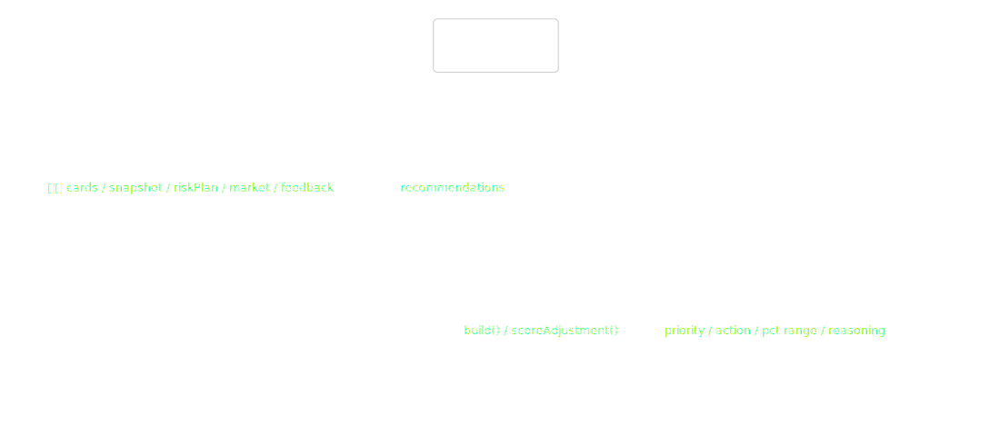
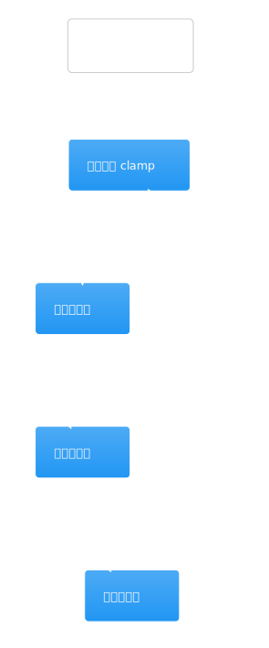
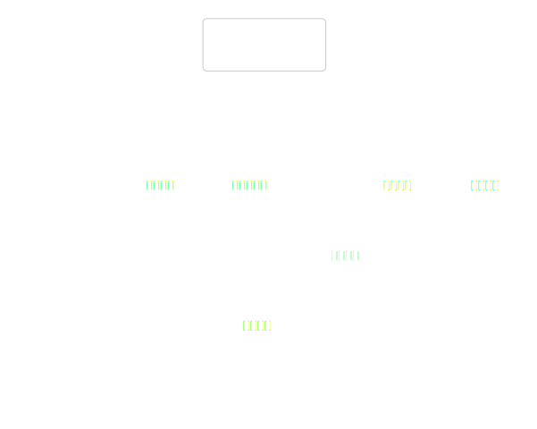
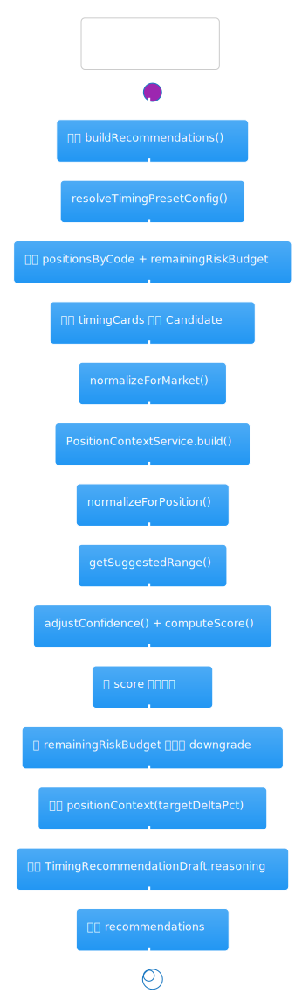
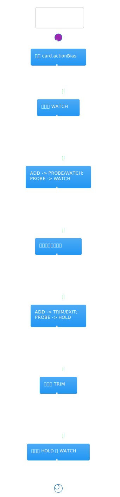
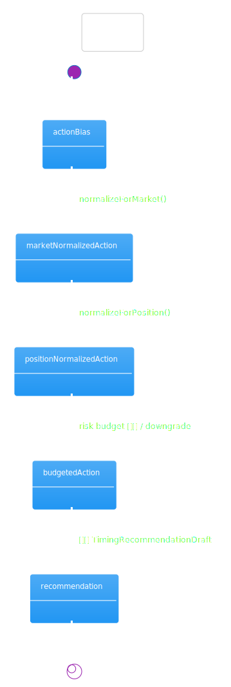
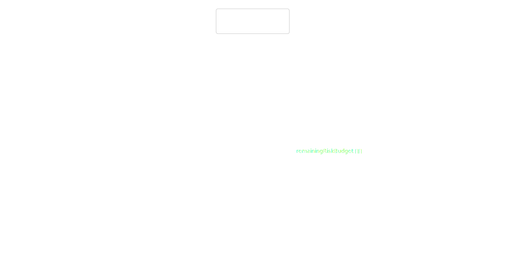

# 热点洞察：watchlist-portfolio-manager-service.ts

- 源文件: `src/server/application/timing/watchlist-portfolio-manager-service.ts`
- 实际阅读入口: `buildRecommendations()`
- 推荐配套阅读: [`watchlist-risk-manager-service`](./watchlist-risk-manager-service.md) / [`timing-feedback-service`](./timing-feedback-service.md) / [`watchlist-timing-graph`](../langgraph-watchlist-timing-graph/analysis.md)
- 这页重点: 搞清楚单股 timing card 是怎样被翻译成带仓位区间、优先级和解释文本的组合建议

这个文件是“择时组合”最像决策器的一层。它先把每张 timing card 映射到持仓语境，再叠加市场状态、风险预算和反馈上下文，最后产出可以直接展示与落库的 `TimingRecommendationDraft`。如果只读 graph 而不读这里，很难理解为什么同一张卡在不同仓位和市场条件下会变成不同动作。

## 架构图组

### 架构总览图

图前说明：先看它位于哪一层，以及它真正依赖的不是仓储而是“上下文服务”。

图后解读：这个 service 的关键输入有 5 组：`timingCards`、`portfolioSnapshot`、`riskPlan`、`marketContextAnalysis`、`feedbackContext`。唯一直接注入的内部依赖是 `PositionContextService`，它负责把“当前仓位处于什么位置”这件事算出来。

### 模块拆解图

图前说明：内部可以按“候选生成”“动作归一化”“预算截断”“结果落模”四段看。

图后解读：不要被 `normalizeForMarket()`、`normalizeForPosition()`、`getSuggestedRange()`、`computeScore()` 这些私有方法分散注意力。它们共同服务于一个统一目标：把原始卡片先修正成“在当前组合里可执行的动作”。

### 依赖职责图

图前说明：这张图重点看 `buildRecommendations()` 是怎么拼装多个上下文的。

图后解读：阅读时要区分三类上下文。`signalContext` 来自 timing card 本身，`marketContext` 与 `riskPlan` 来自 graph 前序节点，`positionContext / feedbackContext` 则是在这里被补齐后写进最终建议里。

## 主流程活动图

### 主流程活动图

图前说明：这张图最适合用来理解 `buildRecommendations()` 的两阶段结构。

图后解读：函数不是“一次 map 就结束”。第一阶段先把每张卡变成 `Candidate` 并按分数排序；第二阶段再按剩余风险预算逐个截断、降级或保留，最后才落成 `TimingRecommendationDraft`。理解这一点后，优先级和仓位区间为什么会互相影响就清楚了。

## 协作顺序图

### 协作顺序图

图前说明：时序上最重要的是 `PositionContextService` 在候选生成阶段和结果落模阶段会被用两次。

图后解读：第一次 `build()` 是为了决定动作归一化和风险 flag，第二次 `build()` 则是在预算截断后重算 `targetDeltaPct` 并把更完整的 `positionContext` 写进最终建议。这个“双次建模”是本文件最容易漏看的细节之一。

## 分支判定图

### 分支判定图

图前说明：这里的分支决定了原始 `actionBias` 会不会被改写。

图后解读：关键分支有四层。先按市场把不合时宜的 `ADD / PROBE` 变钝，再按持仓语境把“临近失效位”“成熟盈利遇到转弱”这种情况转成 `TRIM / EXIT / HOLD`，随后根据动作推导仓位区间，最后再看剩余风险预算是否足以支撑该动作，否则继续降级成 `HOLD` 或 `WATCH`。

## 状态图

### 状态图

图前说明：这里的状态图最适合理解“动作是怎样被一层层重写的”。

图后解读：把动作看成一个小状态机最容易懂：`actionBias` -> `marketNormalizedAction` -> `positionNormalizedAction` -> `budgetedAction`。最终展示给用户的动作不是任何单一 service 直接给出的，而是多轮约束之后的结果。

## 数据/依赖流图

### 数据/依赖流图

图前说明：按输入对象一路追到 `reasoning` 里的各个子对象，最能看清这个文件在“装配”什么。

图后解读：这个 service 不是只输出动作。它还同时输出 `suggestedMinPct / suggestedMaxPct`、`confidence`、`priority`、`riskFlags`、`marketContext`、`positionContext`、`feedbackContext` 和 `actionRationale`。所以它更像“组合建议整形器”，而不是单纯的打分器。

结尾总结：阅读这份代码时，最好把它当成“组合层的决策后处理器”。前面的 card 告诉它“单股怎么看”，它负责回答“放进现有组合后，实际应该做什么、做到多大、为什么是现在这个优先级”。
