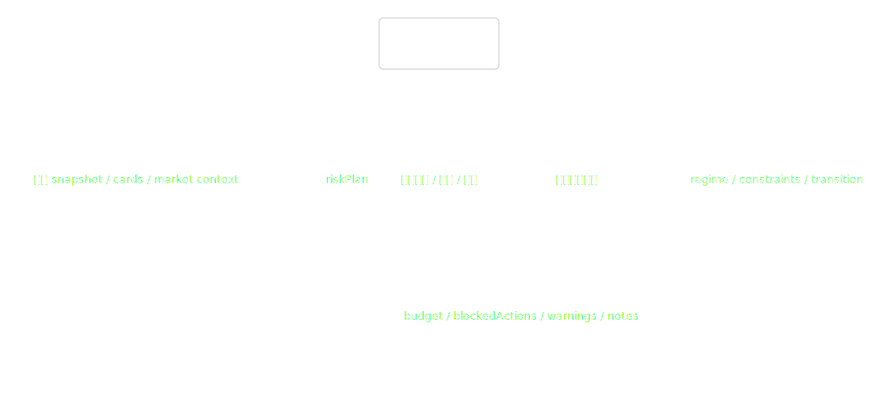
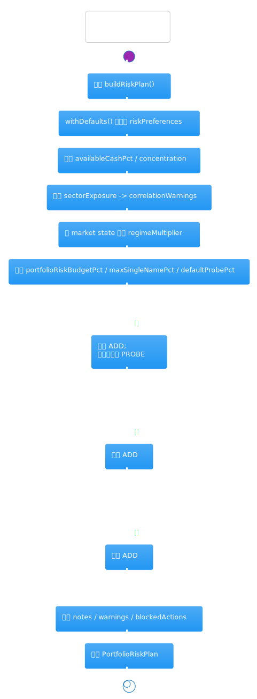
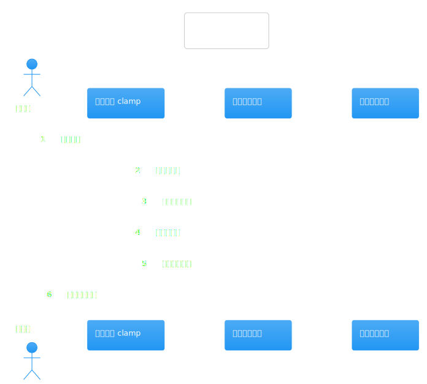
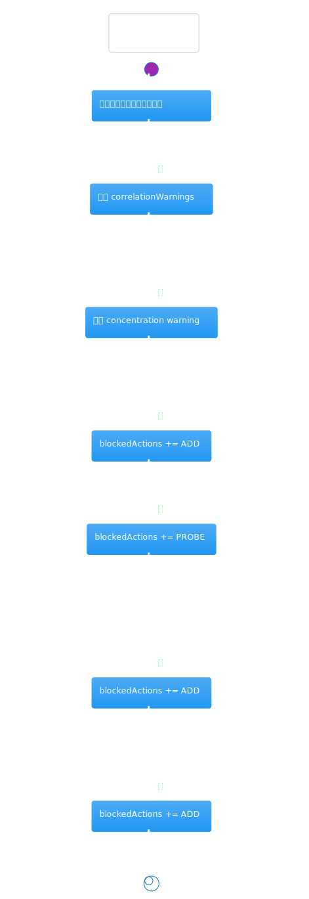
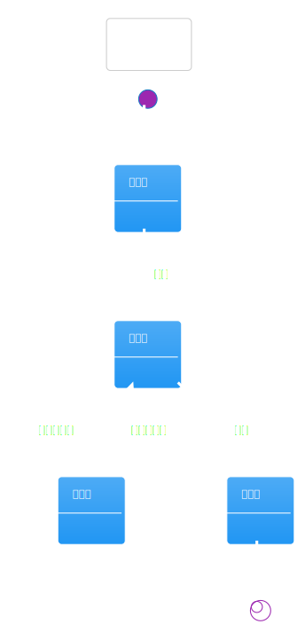
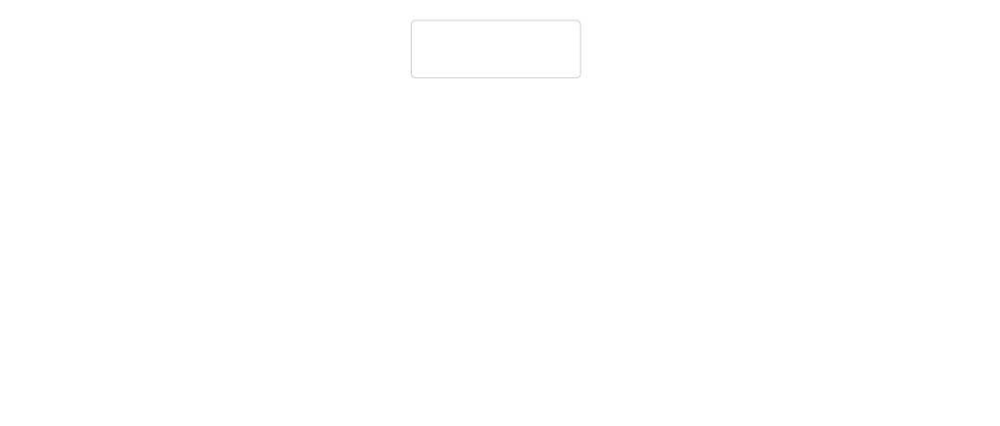

# 热点洞察：watchlist-risk-manager-service.ts

- 源文件: `src/server/application/timing/watchlist-risk-manager-service.ts`
- 实际阅读入口: `buildRiskPlan()`
- 推荐配套阅读: [`watchlist-timing-graph`](../langgraph-watchlist-timing-graph/analysis.md) / [`watchlist-portfolio-manager-service`](./watchlist-portfolio-manager-service.md)
- 这页重点: 搞清楚组合建议之前，系统是如何先把“可出手的风险预算”算出来的

这个文件不是在选股票，而是在给后续组合建议设置“护栏”。它把组合快照里的风险偏好、现金比例、持仓集中度、行业暴露、市场 regime 和当前 timing cards 统一折成一个 `riskPlan`，后面的组合动作都要在这个计划约束下生成。

## 架构图组

### 架构总览图

图前说明：先看清这个 service 的位置，它在 graph 里属于“先算护栏、再谈动作”的那一环。

图后解读：`WatchlistRiskManagerService` 没有外部依赖，它完全是一个纯计算服务。输入是 `portfolioSnapshot + timingCards + marketContextAnalysis`，输出是给组合建议阶段消费的 `PortfolioRiskPlan`。

### 模块拆解图

图前说明：可以把内部步骤理解成“偏好归一化”“组合现状测温”“市场收缩/放大”“动作封禁”四段。

图后解读：这里最值得单独记住的是 `withDefaults()`。它先把用户快照里的风险偏好钳到安全区间，后面所有预算计算都基于这个归一化后的偏好，而不是直接相信前端原值。

### 依赖职责图

图前说明：虽然没有注入依赖，但这张图有助于把输入对象各自的职责拆开。

图后解读：`portfolioSnapshot` 提供现金和持仓事实，`marketContextAnalysis` 决定 risk-on/risk-off 的收缩系数，`timingCards` 只在最后一步参与“是否还有进攻型动作值得保留”的判断。

## 主流程活动图

### 主流程活动图

图前说明：这张图最适合回答“`riskPlan` 里每个字段到底从哪一步来的”。

图后解读：阅读时按这个顺序就够了：先规范风险偏好，再算现金比例和持仓集中度，再汇总行业暴露警告，之后根据市场状态收缩预算、单票上限和 probe 仓位，最后给出 `blockedActions / correlationWarnings / notes`。

## 协作顺序图

### 协作顺序图

图前说明：这个文件没有外部 IO，这张图更适合当作“输入汇入顺序”来看。

图后解读：可以把顺序理解成“先读 snapshot，后看 market，再用 cards 做最后修正”。如果反过来按卡片先做动作判断，容易忘掉这个 service 的第一职责其实是保守约束而不是放大信号。

## 分支判定图

### 分支判定图

图前说明：这里的核心不是数值公式，而是哪几种条件会直接封禁 `ADD / PROBE`。

图后解读：四个分支最关键：`RISK_OFF` 先封 `ADD`，预算过小再封 `PROBE`；现金占比不足也会封 `ADD`；如果所有 timing card 都不是进攻型动作，同样会封 `ADD`；行业暴露和单票集中度超限则只追加 warning，不直接改动作。

## 状态图

### 状态图

图前说明：这里的状态更适合按“预算激进程度”理解，而不是持久化状态。

图后解读：你可以把输出想成三档。`RISK_ON` 接近原始偏好，`NEUTRAL` 做中度收缩，`RISK_OFF` 则同时压低 `portfolioRiskBudgetPct`、`maxSingleNamePct` 和 `defaultProbePct`，并开始封禁进攻动作。

## 数据/依赖流图

### 数据/依赖流图

图前说明：这张图能帮你快速对上 `riskPlan` 字段与输入字段的来源关系。

图后解读：最容易误解的地方在于 `blockedActions` 不是纯市场规则，也不是纯组合规则，而是“市场状态 + 现金约束 + timing card 倾向”三者共同决定的结果。

结尾总结：把这个文件当成“组合护栏生成器”来读最省力。它不负责告诉你该买谁，只负责告诉后面的组合建议器“最多能怎么买、哪些动作现在根本不该出现”。
