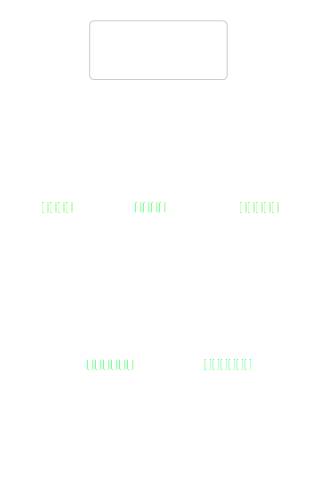
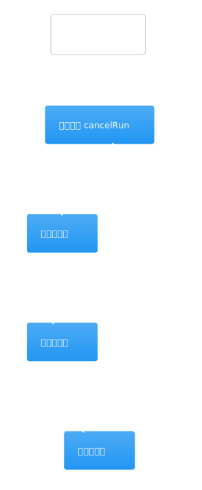
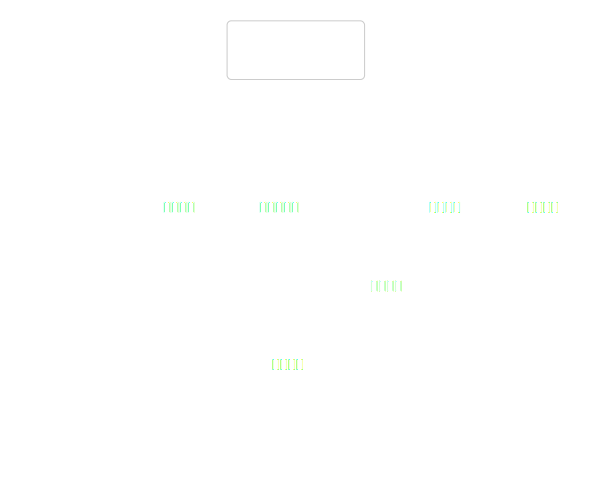
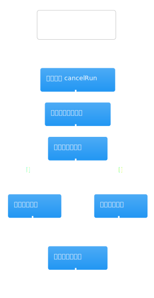
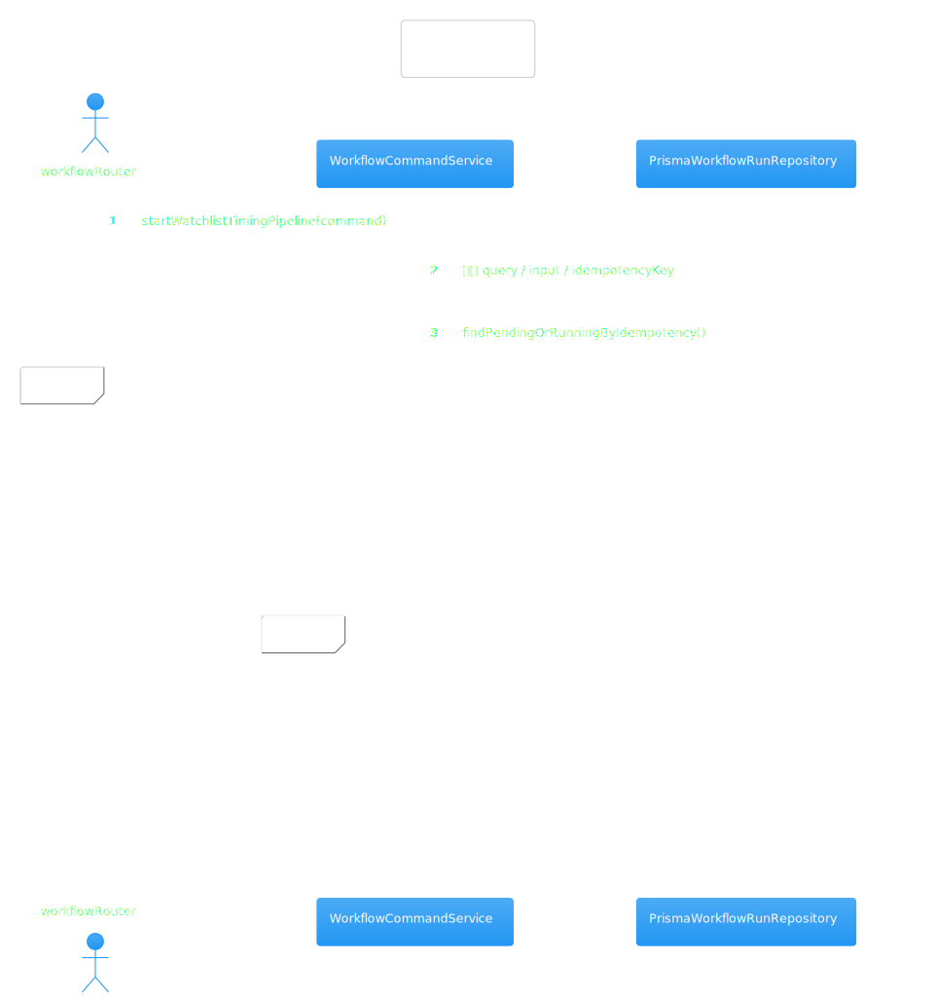
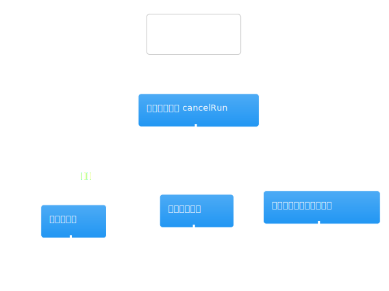
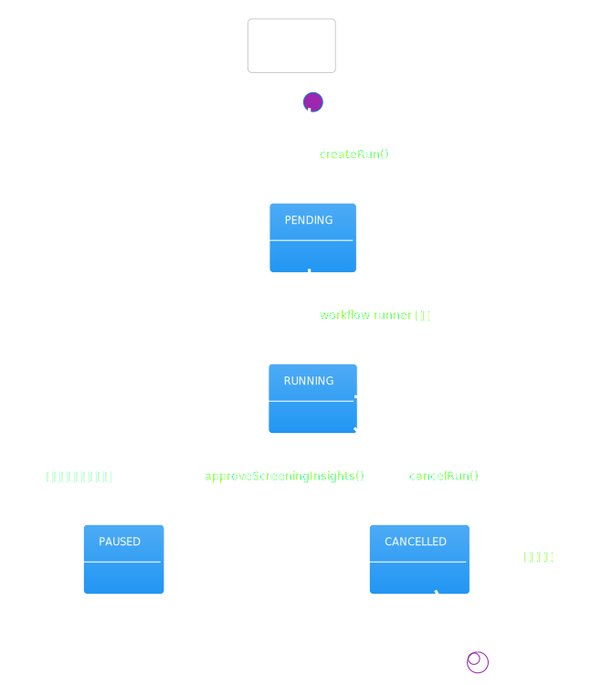
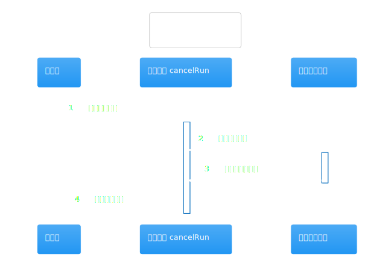

# 热点洞察：command-service.ts

- 源文件: `src/server/application/workflow/command-service.ts`
- 热点分数: `81`
- 为什么难: 这是一个通用工作流入口，既要处理公司研究，也要处理筛选、择时等多条流水线；公司研究只是其中一支。
- 建议先看函数: `startCompanyResearch`、`startWorkflow`、`cancelRun`

如果你只关心公司研究，请把这页理解成“run 装配器”。这里不做研究本身，只负责把输入变成一次可执行的 workflow run，并确保模板版本、幂等键和运行状态都正确。

## 先带着这 3 个问题看图

1. `startCompanyResearch()` 到底只是薄封装，还是会改写业务输入？
2. 为什么没有显式传 `templateVersion` 时，仍然会落到公司研究 V4？
3. 创建 run 之前有哪些幂等、模板和状态守卫？

## 架构图组

### 架构总览图

图前说明：把这个 service 放在前端和 LangGraph 之间看。上游是 tRPC router，下游是 `PrismaWorkflowRunRepository` 和 `RedisWorkflowRuntimeStore`。

图后解读：这张图最重要的结论是，`command-service` 负责“把 run 建出来”，真正执行图的是后面的 execution service 和 graph registry。

### 模块拆解图

图前说明：这个文件虽然长，但对公司研究来说只需要分成三块来理解：命令类型定义、各条流水线的 `startXxx` 包装器、统一的 `startWorkflow()`。

图后解读：真正复杂的热点几乎都在 `startWorkflow()`。`startCompanyResearch()` 只是把页面输入包装成 `StartWorkflowCommand`。

### 依赖职责图

图前说明：先看清它最关键的两个依赖。repository 负责模板和 run 持久化，runtimeStore 负责恢复或继续运行时状态。

图后解读：如果你在排查“为什么没有创建新 run”或“为什么恢复失败”，先看 repository 和 runtimeStore 的交互，而不是去翻前端。

## 主流程活动图

### 主流程活动图

图前说明：从公司研究视角看，主流程就是 `startCompanyResearch()` 进入 `startWorkflow()` 这一段。

图后解读：活动图对应的关键源码是 `startWorkflow()` 中的三步：先查幂等键，再确保模板存在，最后创建 run。公司研究默认会通过 `ensureCompanyResearchTemplate()` 补齐到至少 V4。

## 协作顺序图

### 协作顺序图

图前说明：顺序图重点看 repository 调用顺序，尤其是“查现有 run -> 查模板 -> 补模板 -> 创建 run -> 发布事件”。

图后解读：如果你在排查重复 run、模板版本不对或恢复逻辑失效，这张图比单看 `startWorkflow()` 更容易定位问题。

## 分支判定图

### 分支判定图

图前说明：这个文件的复杂度主要来自分支。公司研究相关最重要的分支有两个：幂等命中直接返回已有 run，以及模板版本不足时自动补齐到最新模板。

图后解读：读这张图时，把“业务分支”和“不同模板代码的兼容分支”分开看，会清楚很多。

## 状态图

### 状态图

图前说明：状态图主要帮助理解 `cancelRun()` 和 `approveScreeningInsights()` 这种状态守卫逻辑。

图后解读：对公司研究最有价值的是看清 run 创建后会处于什么状态，以及取消/恢复时允许哪些状态迁移。

## 异步/并发图

### 异步/并发图

图前说明：这里没有像研究执行那样的并发采集，但有多次异步 IO，尤其是 repository 和 runtimeStore 的串行协作。

图后解读：如果页面点击开始后迟迟看不到新 run，通常问题就落在这张图展示的几个异步节点上。
